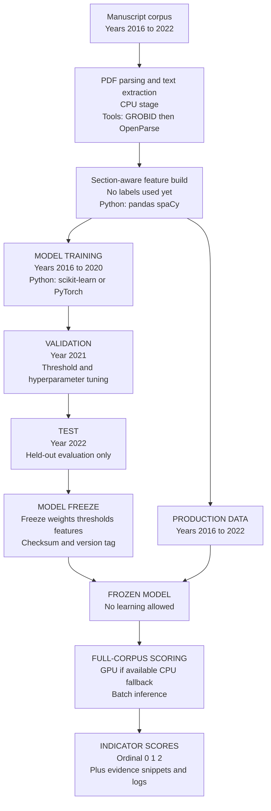
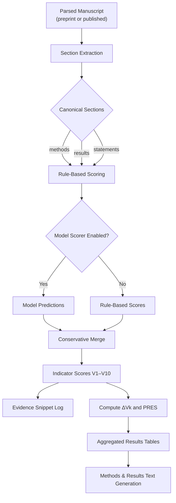

# Methods: Model Training, Scoring, and Result Generation

## Purpose of This Document

## Current Python Implementation Status

The current repository implements the methodology-level scoring orchestration in
`src/peer_elt/transform/methodology.py`. This layer does not define new scoring
rules. It applies the fixed V1-V10 workflow from the preregistered planning
document by:

- scoring preprint and published manuscript versions independently
- retaining all preregistered indicators V1-V10, including explicit 0 scores
- computing raw statistical rigour scores for each manuscript version
- computing indicator-level changes as `published - preprint`
- computing the Peer-Review Effect Score (PRES)
- exporting flat pair-level records and evidence rows for audit
- flagging manuscript versions with one or more zero scores for
  document-completeness review

The current scorer is dependency-injected. In tests and baseline execution it
uses the existing conservative rule-based or hybrid scorer from
`src/peer_elt/transform/scoring.py`. Model training and frozen model artifacts
remain planned implementation work; this document's model-development sections
describe the intended measurement-instrument lifecycle and do not indicate that
production model training has already been completed.

---

This document describes **how results were generated**, including the machine-learning–assisted scoring pipeline, temporal data splits, model freezing procedures, and the rationale behind these design choices.

This document is descriptive, not preregistered. All inferential decisions are governed by the preregistered planning document. This file exists to ensure transparency, reproducibility, and auditability of the analytic workflow, without introducing analytic discretion. All scoring rules, indicators, thresholds, and aggregation logic are fully specified in the preregistered planning document; this file documents only their computational implementation.

---
## Reader’s Map: Model Development, Freeze, and Scoring Workflow


**Figure 1. Lifecycle of the scoring instrument (training, evaluation, and freeze).**  
This figure situates the reader in the temporal lifecycle of the scoring instrument. Manuscripts are parsed and transformed into section-aware representations prior to any modeling. A temporally separated training (2016–2020), validation (2021), and test (2022) scheme is used during model development. After evaluation, the model is frozen and applied without further learning to all manuscript pairs from 2016–2022. No parameters, thresholds, or feature representations are updated beyond the model-freeze boundary shown.

---
## Phase I: Construction of the Scoring Instrument

Manuscript changes between preprint and published versions were quantified using a fixed, automated scoring model trained to assign ordinal indicator scores (0 = Absent, 1 = Partial, 2 = Clear) for each preregistered indicator.

The model functions as a **measurement instrument**, analogous to a trained human rater, and is applied uniformly across the full analysis corpus once training and validation are complete.

---
### Data Scope

- **Corpus:** Matched preprint–published manuscript pairs
- **Preprint sources:** bioRxiv, medRxiv
- **Eligible preprint posting dates:** January 1, 2016 – December 31, 2022
- **Unit of analysis:** manuscript pair

All manuscripts scored in the production phase fall within this temporal window.

---
### Training, Validation, and Test Splits

To minimize temporal leakage and assess robustness to time-dependent reporting changes, data were split by **publication year**, not randomly.
#### Temporal splits

- **Training set:** 2016–2020
- **Validation set:** 2021
- **Test set:** 2022

These splits were used **only during model development**.

The test set was not used for model selection, threshold adjustment, or feature engineering.

---
### Training Data Size and Labeling

- Target training size: approximately 800–1,200 manuscript pairs
- Indicators scored: preregistered ordinal indicators (0/1/2)
- Evidence snippets were logged for every score
- A subset of training data (approximately 15–25%) was double-coded to assess
  inter-rater reliability and guide model calibration

Human coding followed the preregistered codebook and scoring rules.

---
### Model Development

During model development:

1. Text was extracted from PDFs using a structured parsing pipeline
2. Features were derived from section-aware text representations
3. Models were trained to predict indicator scores independently
4. Hyperparameters and decision thresholds were selected using validation data
5. Final evaluation was conducted on the held-out 2022 test set

Model performance metrics were recorded but are reported separately from substantive study outcomes.

---
### Model Freezing and Versioning

After evaluation on the test set, the model was **frozen**:

- Model architecture fixed
- Weights fixed
- Thresholds fixed
- Feature extraction pipeline fixed
- Code version tagged in the repository
- Model artifacts checksummed

No additional learning, tuning, or parameter updates occurred after this point.

The frozen model defines the scoring instrument used for all reported results.

---
### Interpretation

The term ‘prediction’ is used operationally to denote automated score assignment and carries no inferential or probabilistic interpretation.

---
## Phase II: Application of the Frozen Scoring Instrument

All model development occurs prior to this phase; no results, comparisons, or aggregations are produced until indicator scores are fixed. Following model freezing, the scoring model was applied to:

- **All eligible manuscript pairs from 2016–2022**

During this phase:

- No labels were used
- No parameters were updated
- No thresholds were modified
- Scoring was fully deterministic given inputs

The output of this phase consists of:
- Indicator scores (0/1/2)
- Associated evidence snippets
- Metadata linking scores to manuscript pairs

---
### Interpretation of Indicator Scores

Model outputs are treated as **observational measurements**, not predictions.

The study does **not** interpret model accuracy as evidence that:
- Scores represent objective truth
- Changes reflect improvement or deterioration
- Peer review causally improves manuscript quality

Instead, scores represent:
> Observable differences in reporting and content between manuscript versions, as detected by a fixed scoring instrument.

---
### Use of Training Data in Measurement

Some manuscripts scored in the production phase were also present in the training or validation sets.

This is intentional and methodologically acceptable because:

- The model was frozen prior to production scoring
- The unit of inference is the manuscript, not model generalization
- The model functions as a trained rater, not a predictive estimator

Performance metrics are reported using held-out test data only.

This design is directly analogous to the use of trained human raters, whose prior exposure to training materials does not invalidate subsequent descriptive measurement once scoring criteria and decision rules are fixed. This reuse affects neither indicator definitions nor scoring behavior, which are fixed prior to production scoring.

---
### Robustness and Validation Checks

Optional robustness checks include:

- Manual auditing of a subset of 2022 manuscripts
- Comparison of score distributions across years
- Sensitivity analyses excluding training-period manuscripts

These checks are descriptive and do not alter preregistered analyses.

---
### Computational Environment

- CPU preprocessing: PDF parsing, text extraction, feature preparation
- GPU scoring (when available): batch inference
- CPU fallback scoring used if GPU resources were unavailable within the
  allocated scheduling window

All runs are logged with timestamps and environment metadata.

---
### Reproducibility

The full pipeline is reproducible given:

- Frozen model artifacts
- Versioned code repository
- Logged configuration files
- Input manuscript identifiers

No manual intervention occurred during production scoring.

---
### Phase I-II Summary

In summary:

- A temporally separated training/validation/test scheme was used
- The model was frozen prior to full-corpus scoring
- All manuscripts from 2016–2022 were scored using the same fixed instrument
- Results represent descriptive measurements, not causal or normative claims

This design aligns with the preregistered study goals of transparency,
replicability, and non-normative assessment of manuscript change.

---
# Phase III: Derivation and Reporting of Within-Manuscript Changes

This phase performs no statistical testing, estimation, or model fitting; it transforms fixed scores into summaries for reporting. This document describes how preregistered statistical‐rigor indicators (V1–V10) are operationalized in code and how fixed scoring outputs are transformed into reproducible Methods and Results sections. This file documents **implementation details only** and does not supersede the preregistered codebook ([`Appendix A of the peer review planning document`](peer_review_planning_document.md#appendix-a-preregistered-codebook-for-statistical-rigor-indicators-v1-v10)).

---
## 1. Role of Phase III in the Study

This document records post-instrument implementation details only. All indicator definitions, scoring rules, thresholds, and aggregation logic are fixed in the preregistered planning document and codebook.

No new analytic decisions, scoring criteria, or interpretive rules are introduced here.

---
## 2. Execution Pipeline for Fixed Indicator Scoring



**Figure 2. Execution pipeline for fixed indicator scoring and results construction.**  
This figure depicts the irreversible execution path from parsed manuscript text to fixed indicator scores, within-manuscript change metrics ($\Delta V_k$), and deterministic construction of aggregated results and reported text. No learning, tuning, or interpretive decisions occur within this pipeline.

For each matched manuscript pair (preprint and published version), scoring proceeds in the following stages:

1. **Document parsing and sectionization**

2. **Rule‑based indicator detection**

3. **Optional model‑assisted scoring**

4. **Conservative score merging**

5. **Delta computation and aggregation**

6. **Evidence logging for auditability**


All steps are applied symmetrically to preprint and published versions.

---
## 3. Manuscript Parsing and Section Canonicalization  (Execution Stage)

Each manuscript is parsed into structured text sections and normalized into canonical analytical sections used consistently across all indicators. At minimum, the following canonical sections are constructed:

- `methods`

- `results`

- `statements` (data/code availability and related disclosures)


These sections are represented as a mapping:

```python
sections: Mapping[str, str]
```

If a section is missing or cannot be reliably extracted, an empty string is supplied and the indicator is treated conservatively.

---
## 4. Indicator Detection and Scoring  (Fixed Rules)
### 4.1 Rule-Based Indicator Detection

A conservative rule‑based scorer is applied using preregistered indicator cues expressed as regular‑expression patterns. Each rule specifies:

- indicator (V1–V10)

- ordinal level (0–2)

- target section

- regex pattern

For each matched pattern:

- Up to three evidence snippets are retained

- The maximum matched level per indicator is recorded

Rule‑based scores correspond directly to preregistered indicator definitions and are interpreted as **assistive operationalization**, not independent criteria.

---
### 4.2 Model-Assisted Indicator Scoring (Optional)

Where enabled, a model scorer may generate indicator‑level predictions with associated confidence scores. Model outputs are converted into indicator scores using the same 0–2 ordinal scale.

Model predictions are never used in isolation and do not override preregistered definitions. Automated assistance cannot increase an indicator score unless model confidence exceeds a preregistered threshold.

---

## 5. Hybrid Scoring Logic and Conservatism Guarantees

When both rule-based and model-assisted scores are available, a conservative merge strategy is applied to ensure that automated assistance cannot inflate indicator scores beyond preregistered bounds.

- If model confidence ≥ predefined threshold (default 0.8), the model score is used

- Otherwise, the lower of the rule‑based and model‑based scores is assigned

All contributing evidence snippets are retained.

This strategy ensures that automated assistance cannot inflate indicator scores beyond preregistered bounds. In all other cases, conservative dominance applies.

---
## 6. Fixed Indicator Outputs and Data Structures

For each manuscript version, the scoring process yields:

- Indicator score (0–2)

- Rationale for the assigned score

- Evidence snippets with source section and matched pattern

- Document-completeness review flag when one or more indicators are scored 0

Scores are stored in structured records to enable reproducibility and independent audit.

---
## 7. Within-Manuscript Change Metrics ($\Delta V_k$ and PRES)

For each matched manuscript pair, within‑manuscript change is computed as:
$$\Delta V_k = V_{k,published} - V_{k,preprint}$$

In Python, this is represented by `PairScorecard.indicator_deltas` and
`PairScorecard.pres`. `PairScorecard.to_record()` emits a flat table-ready row
with V1-V10 preprint scores, V1-V10 published scores, V1-V10 deltas, raw version
scores, PRES, document formats, and document-completeness review flags.

The Peer‑Review Effect Score (PRES) is computed as the sum of published indicator scores minus the sum of preprint indicator scores.

All summaries are descriptive and interpreted within the preregistered non‑causal framework. 

---
## 8. Evidence Logging and Audit Trail

Evidence excerpts are mechanically selected based on rule matches or model-provided evidence, not manually curated. All
evidence snippets contributing to indicator scores are logged with:

- manuscript identifier

- version (preprint or published)

- document format when known

- indicator

- assigned score

- scoring rationale

- section

- matched pattern

- verbatim text excerpt

These logs support reproducibility, verification, and post hoc inspection. Evidence snippets are mechanically extracted
based on matched rule patterns or model-supplied evidence; no post hoc selection, paraphrasing, or curation is
performed.

---
## 9. Deterministic Construction of Aggregated Results

Aggregated results are constructed programmatically from fixed scoring outputs and include:

- Number of included manuscript pairs

- Distribution of indicator‑level changes ($\Delta V_k$)

- Distribution of PRES values

- Counts of indicators showing improvement, no change, or decline

No inferential testing or causal claims are introduced at this stage. No weighting, normalization, thresholding, or inferential interpretation is applied to composite scores.

---
## 10. Deterministic Generation of Methods and Results Text

Methods and Results text is generated deterministically from aggregated tables and logged summaries. No interpretive or inferential logic is introduced at this stage. This document records implementation details for transparency and reproducibility. In the event of any discrepancy:

- The preregistered planning document and codebook govern

- This file is interpreted as descriptive documentation only

No scoring rules, thresholds, or indicators are modified by this implementation.

---
## 11. Scope, Constraints, and Non-Binding Status

At no point does results generation introduce new scoring decisions, thresholds, or interpretive rules beyond those defined in the preregistered codebook.
