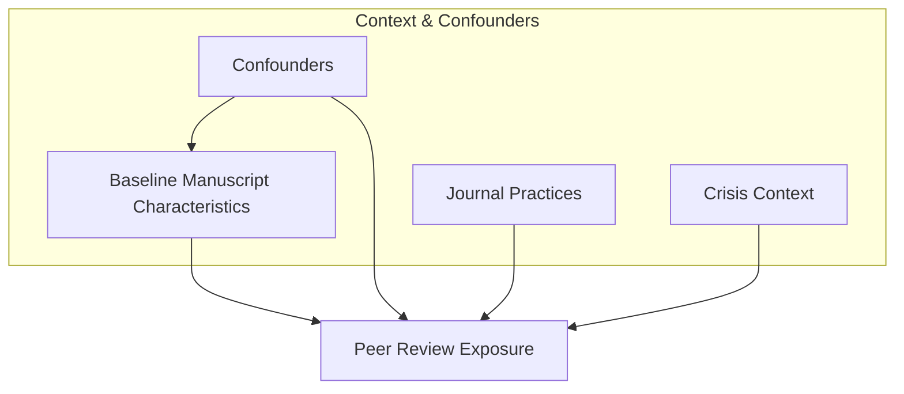
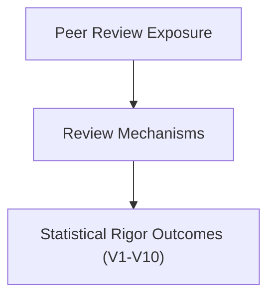
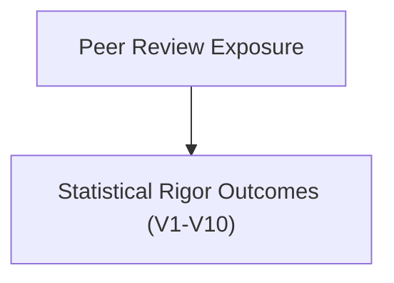
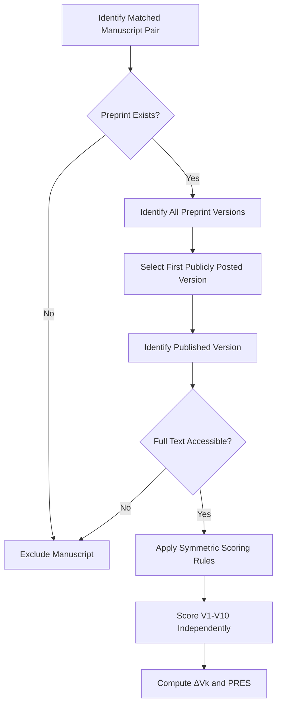

# **Peer-Review Impact Study — Planning & Preregistration**

**Status:** Planning stage  
**Data Accessed:** ❌ No  
**Analysis Performed:** ❌ No  
**Preregistration Lock Date:** Feb 3, 2026, 1:22:08 PM MST

---
## 1. Study Overview

This study examines how peer review is **associated with observable changes in statistical rigor** by comparing preprint manuscripts with their corresponding peer‑reviewed published versions.

This preregistration constitutes a **binding analytic commitment** for Study 1. All variable definitions, scoring rules,
inclusion criteria, and analytic constraints described herein are fixed prior to data access and may not be modified
without explicit documentation of deviations.

The study is **observational**, **comparative**, and **non‑causal**. It does not assume that peer review necessarily
improves scientific quality, nor that observed changes are inherently beneficial. Observed changes may be positive,
negative, or null, and no directional improvement is presumed. Instead, it aims to **quantify what changes**, **in which
dimensions**, and **under what contextual conditions**, using preregistered indicators of statistical rigor.

The study prioritizes **transparency, preregistration, and reproducibility**, and explicitly avoids causal attribution.
In practical terms, this study operationalizes statistical rigor using ten preregistered, independently scored
indicators (V1-V10). Each indicator is evaluated symmetrically for the preprint and published versions of the same
manuscript prior to any comparison, ensuring that observed differences reflect reporting changes rather than post hoc
judgment or selective emphasis.

**Document hierarchy note.** This preregistration constitutes the **authoritative and binding specification** of Study

1. All summaries, public-facing descriptions, and reader guides associated with this project are **non-normative** and
   are intended solely to aid interpretation; in the event of any discrepancy, the present preregistration governs.

---
## 2. Research Question

### RQ‑001

**Does peer review increase statistical rigor between preprint and published versions of manuscripts?**

A non-technical public summary accompanies this preregistration to clarify scope, interpretation, and non-goals for
broader audiences.

### Why This Matters

Peer review is widely treated as a quality‑assurance mechanism, yet prior evidence suggests its effects on statistical rigor are often **small, heterogeneous, and context‑dependent**. Understanding which aspects of rigor change—and which do not—has implications for editorial policy, research evaluation, and the role of preprints in scientific communication.

### Explicit Non‑Goals

This study does **not** aim to:

- Estimate causal effects of peer review

- Assess reviewer intent or reviewer quality

- Rank journals, publishers, or authors

- Evaluate novelty, importance, or writing quality

### Interpretation of Null Findings

**Null findings are substantively informative in this context.** Peer review is widely assumed to improve statistical rigor; observing no systematic change challenges that assumption and places empirical bounds on the magnitude and consistency of peer review’s influence in practice. Such stability suggests that core statistical decisions are often determined prior to review and that meaningful improvements, where they occur, are likely heterogeneous and dependent on review structure and context rather than review presence alone.

---
## 3. Core Literature Review (Design‑Motivating)

This section summarizes prior research that motivates the study design and variable selection. Citations are provided
solely for conceptual grounding and are not used to derive directional hypotheses, expected effect sizes, or causal
claims. The study remains explicitly non-causal and null-tolerant by design.

The literature on peer review and preprints consistently shows that **large improvements in statistical outcomes are uncommon**, while **modest improvements in reporting and transparency are more plausible**. Prior studies differ in scope, metrics, and inferred mechanisms, motivating a preregistered, multi‑indicator approach.
### 3.1 Effect Estimates and Stability

Multiple studies report substantial stability in effect estimates between preprint and published versions. For example, Davidson et al. (2024) and Nelson et al. (2022) find that peer review rarely reverses effect direction and only modestly alters magnitude, suggesting that core quantitative results are often determined prior to review.

These findings motivate inclusion of **V1 (effect estimates)** while tempering expectations of large average changes.
### 3.2 Reporting Quality and Transparency

Broader improvements are more commonly observed in statistical reporting practices. Carneiro et al. (2020) and Garcia‑Costa et al. (2022) document modest post‑review improvements in uncertainty reporting, model clarity, and disclosure, though gains are inconsistent and metric‑dependent.

These findings directly motivate **V2, V3, V5, V6, V7, and V9**, emphasizing reporting rather than correctness.
### 3.3 Review Structure and Mechanisms

Evidence suggests that peer review’s impact depends on structure rather than mere presence. Soderberg et al. (2021) show that prereview of methods yields larger rigor gains than conventional post‑hoc review. Lu and Daugherty (2022) further argue that unstructured review is unlikely to substantially improve statistical rigor.

These findings motivate explicit consideration of review mechanisms and journal practices as moderators.
### 3.4 Heterogeneity and Contextual Boundary Conditions

Several studies caution against treating peer review as uniformly beneficial. Kodvanj et al. (2022) demonstrate that under crisis or time‑pressure conditions, peer‑reviewed articles are not consistently more rigorous than preprints, underscoring the importance of context and timing.

This motivates preregistered heterogeneity analyses and contextual stratification.

### **3.5 Design Implications for Measurement**

Taken together, the reviewed literature motivates a design that prioritizes within-manuscript comparison, preregistered
indicators, and null-tolerant interpretation. These considerations directly inform the operational definitions, scoring
rules, and analytic constraints specified in subsequent sections.

### 3.6 References Cited (Design‑Motivating, Non‑Evidentiary)

The following references are cited **for conceptual grounding only** and are not used to derive hypotheses, expected directions, or effect sizes.

- Davidson, M., Evrenoglou, T., & Graña, C. (2024). _Comparison of effect estimates between preprints and peer‑reviewed journal articles of COVID‑19 trials_. **BMC Medical Research Methodology**.

- Nelson, L. D., Simmons, J. P., & Simonsohn, U. (2022). _Preprint persistence and effect stability_. **Meta‑Research Journal**.

- Carneiro, C. F. D., et al. (2020). _Comparing quality of reporting between preprints and peer‑reviewed articles in the biomedical literature_. **Research Integrity and Peer Review**, 5(1).

- Garcia‑Costa, D., et al. (2022). _Does peer review improve the statistical content of manuscripts?_ **Royal Society Open Science**, 9(9).

- Soderberg, C. K., et al. (2021). _Initial evidence that preregistration improves reproducibility_. **Proceedings of the National Academy of Sciences**.

- Lu, S. F., & Daugherty, P. J. (2022). _Peer review under constraint: Why structure matters_. **Science and Engineering Ethics**.

- Kodvanj, I., et al. (2022). _The quality of COVID‑19 evidence in preprints and peer‑reviewed articles_. **BMJ Open**.

---

## 4. Conceptual Model (Causal‑DAG-Informed, Non‑Causal)

Observed changes arise from interacting processes involving baseline manuscript characteristics, review exposure, review mechanisms, and contextual moderators. All observed differences are interpreted as **associations**, not causal effects.

---
## 5. Formal DAGs (Conceptual)

The DAGs presented in this section are included **for conceptual clarification and design transparency only**. They are
not used to derive causal estimands, adjustment sets, or inferential claims, and should be interpreted strictly as
structural representations consistent with the study’s non-causal, descriptive framework.
### 5.1 Exposure Assignment
#### **Figure A. Exposure Assignment and Contextual Determinants**



**Figure A.** Conceptual diagram illustrating factors associated with **peer review exposure**. Baseline manuscript
characteristics, journal practices, and contextual factors (e.g., crisis conditions) jointly influence whether and how
manuscripts undergo peer review. This diagram is used to clarify **selection processes and contextual structure only**
and does not imply causal estimation or adjustment. Statistical rigor indicators (V1-V10) are downstream outcomes and
are therefore excluded from the exposure-assignment diagram.

### 5.2 Mediated Effects (Primary Estimand)
#### **Figure B1. Mediated Pathway: Peer Review → Review Mechanisms → Statistical Rigor**



**Figure B1.** Conceptual diagram representing the **primary analytic framework**, in which peer review exposure
operates through identifiable review mechanisms (e.g., reviewer requests, editorial requirements) to produce observable
changes in statistical rigor indicators (V1-V10). The outcome node represents the vector of preregistered indicators
rather than a single latent construct. Paths are interpreted as **associational and descriptive**, not causal.
### 5.3 Direct Effects (Secondary, Exploratory)
#### **Figure B2. Direct Pathway: Peer Review → Statistical Rigor**



**Figure B2.** Conceptual diagram representing a **secondary, exploratory pathway** in which peer review exposure is
associated with changes in statistical rigor indicators (V1-V10) without explicit mediation through identifiable review
mechanisms. This pathway captures changes plausibly attributable to journal policies or structural requirements rather
than reviewer-specific feedback. Direct effects are treated as exploratory and non-causal.
### 5.4 Formal DAGitty Specifications (Machine-Readable)

The following DAGitty specifications provide a machine-readable representation of the conceptual diagrams above. They are included for **conceptual validation and transparency only**; the study remains explicitly non-causal.
#### Figure B1 — Mediated Peer Review Effects (Primary)

```dagitty
dag {
  title: "Diagram B1 — Mediated Peer Review Effects (Primary)"
  PR   [exposure]
  MECH
  Y    [outcome]

  PR -> MECH
  MECH -> Y
}
```
#### Figure B2 — Direct Peer Review Effects (Secondary / Exploratory)

```dagitty
dag {
  title: "Diagram B2 — Direct Peer Review Effects (Secondary / Exploratory)"
  PR [exposure]
  Y  [outcome]

  PR -> Y
}
```

## 5.5 DAG-to-Variables Alignment (V1-V10)

This section explicitly links each preregistered rigor indicator (V1-V10) to the conceptual DAGs.
#### Figure A (Exposure Assignment)

Figure A specifies determinants of peer review exposure and is not intended to model rigor indicators directly. V1-V10
are downstream outcomes and are therefore excluded from the exposure-assignment diagram.
#### Figure B1 (Mediated Pathway): PR → MECH → Y

In Figure B1, Y is operationalized as the vector of preregistered rigor indicators (V1-V10). Each indicator represents a
measurable manifestation of changes plausibly operating through review mechanisms.

- **V1:** Effect estimate change

- **V2:** Uncertainty reporting

- **V3:** Significance reporting transparency

- **V4:** Power or sample-size justification

- **V5:** Model and covariate specification clarity

- **V6:** Multiplicity handling or disclosure

- **V7:** Robustness or sensitivity analyses

- **V8:** Missing data reporting and handling

- **V9:** Transparency and reproducibility

- **V10:** Study design reporting
#### Figure B2 (Direct Pathway): PR → Y

Figure B2 captures changes plausibly attributable to journal or editorial requirements that may not be traceable to
identifiable reviewer mechanisms. Direct effects are treated as **secondary and exploratory**, with strongest
plausibility for **V9-V10** and partial plausibility for **V3, V5, and V8** depending on journal policy.

---
## 6. Operational Definition of Statistical Rigor

Statistical rigor is operationalized as **transparent, interpretable, and reproducible quantitative reporting**,
measured using the preregistered indicators V1-V10. Indicators reflect reporting transparency rather than the
statistical validity or correctness of analytical choices, which are intentionally outside the scope of this study.

---

## 7. Preregistered Variables (V1-V10)

Each indicator is scored **independently** for the preprint and published versions using a predefined **0-2 ordinal
rubric** (Absent / Partial / Clear).

> **Clarification on Variable Interpretation**
>
> The preregistered variables (V1-V10) are evaluated as **distinct indicators of statistical reporting and analytical
practices**. They are not assumed to reflect a single latent construct, nor are they interpreted as interchangeable
> measures of quality.
>
> A composite score is introduced in the subsequent section strictly as a **descriptive aggregation tool** to facilitate
> comparison and visualization; it is not treated as an inferential index or causal measure.

---
## 8. Scoring and Composite Measures
### Raw Statistical Rigor Score
$$
\sum_{k=1}^{10} V_k \quad[0,20]  
$$
### Peer‑Review Effect Score (PRES)
$$
\text{PRES} = \sum_{k=1}^{10} V_{k,\text{published}} - \sum_{k=1}^{10} V_{k,\text{preprint}}  
$$

PRES is a descriptive aggregation tool and is not interpreted as a latent measure of overall study quality. Accordingly,
composite scores are **descriptive summaries only** and are not used for inferential decision‑making.
### Auxiliary Textual and Structural Metrics (Exploratory)

In addition to preregistered indicators of statistical rigor (V1-V10), a set of auxiliary textual and structural
manuscript characteristics is recorded descriptively for both preprint and published versions.

These metrics include:

**Textual readability metrics**

- Readability indices (e.g., Flesch-Kincaid grade level or equivalent)
- Average sentence length
- Related surface-level text characteristics

**Structural manuscript metrics**

- Total article length (e.g., word count or page count, depending on document format)
- Number of tables
- Number of figures

Changes in auxiliary metrics are summarized descriptively and analysed separately from preregistered rigor indicators.
These metrics are not included in composite scores (e.g., PRES), hypothesis testing, or causal interpretation. Observed
changes may reflect editorial conventions, journal formatting requirements, or stylistic normalization rather than
substantive methodological revision.

---
## 9. Analysis Plan (High‑Level)

- Independent scoring of preprint and published versions

- Primary focus on **within‑manuscript change**

- Distributional analysis of per‑variable changes and PRES

- Exploratory heterogeneity analyses by context and journal practices

- No causal estimands or causal adjustment procedures

Scoring of preregistered indicators (V1-V10) is conducted using the fixed codebook criteria specified in Appendix A.
Scorers may be aware of manuscript version status (preprint vs. published); however, all indicators are scored *
*independently for each version prior to computing within-manuscript change scores**, and evidence excerpts are logged
verbatim for auditability. Version awareness is not treated as a source of analytic flexibility and does not alter
scoring rules, thresholds, or aggregation procedures.

### 9.1 Unit of Analysis and Unit of Inference

The primary unit of analysis is the **matched manuscript pair**, consisting of a preprint version and its corresponding published version.

All statistical summaries, distributions, and comparisons are conducted at the manuscript-pair level. Manuscript pairs are treated as independent observational units.

No inference is made at the author, journal, reviewer, or institution level. Results are interpreted as descriptive associations between manuscript versions, not as estimates of population-level causal effects.

### 9.2 Indicator Availability and Missingness Handling

Each preregistered indicator (V1-V10) is scored independently based on observable reporting content.

When an indicator is **structurally inapplicable** to a manuscript (e.g., power calculations in exploratory analyses where no hypothesis testing is performed), the indicator is scored as **0 (Absent)** rather than excluded.

Composite scores (Raw Statistical Rigor Score and PRES) are computed using the full set of indicators (V1-V10) for all
included manuscripts. No indicators are dropped or reweighted post hoc.

Indicator-level missingness due to document access limitations is handled exclusively through the exclusion rules defined in Section 11.4.

---
## **10. Hypotheses and Interpretation Framework**

This study does **not** preregister directional or alternative hypotheses. All analyses are conducted within a *
*null-tolerant, descriptive framework** appropriate for observational, non-causal comparison of manuscript versions. No
significance thresholds, p-value cut-offs, or confirmatory decision rules are prespecified, as all analyses are
descriptive and non-causal.

For each preregistered indicator $V_k$ ($k = 1, \dots, 10$), within-manuscript change is defined as:

$$
\Delta V_k = V_{k,\text{published}} - V_{k,\text{preprint}}  
$$
### **Indicator-Level Null Hypotheses**

For each indicator:
$$
\mathbb{E}[\Delta V_k] = 0  
$$

These null hypotheses reflect the possibility that peer review is **not systematically associated** with changes in specific aspects of statistical rigor.
### **Composite-Level Null Hypothesis**

For the Peer-Review Effect Score (PRES):
$$
\mathbb{E}[\text{PRES}] = 0  
$$
The composite null represents the absence of systematic aggregate change across preregistered indicators.
### **Interpretation of Deviations**

Observed deviations from the null—whether positive, negative, or near zero—are summarized **descriptively** and interpreted as empirical patterns rather than confirmatory tests of improvement or degradation.

Null or near-null results are considered **substantively informative**, as they place empirical bounds on the magnitude and consistency of peer-review-associated change and inform ongoing debates regarding the role of peer review in shaping statistical reporting practices.

No directional claims, causal inferences, or normative judgments are drawn from these comparisons.

---
# **11. Document Access, Eligibility, and Version Selection**

This section defines the preregistered rules governing document access, eligibility, corpus construction, and version
selection. All rules are applied **symmetrically** to preprint and published versions and are fixed prior to data
access.

## **11.1 Document Access and Full-Text Extraction Rules**

Manuscripts are evaluated using the **most complete and stable full-text representation available** at the time of analysis. Document format is treated as a content container rather than a quality signal.

The following hierarchy is applied consistently to both preprint and published versions:

1. **Publisher-provided PDF** (preferred when available and machine-readable)
2. **Publisher-provided full-text HTML** (used when a PDF is unavailable or inaccessible)
3. **Supplementary materials** (used to clarify reporting but not to replace missing core sections)

Abstract-only pages, truncated previews, or partial text views are not considered sufficient for evaluation.
## **11.2 Use of Supplementary Materials**

Supplementary materials (e.g., appendices, supplementary methods, CONSORT/STROBE checklists) may be consulted to **supplement** reporting indicators.

Supplementary materials may increase an indicator score only when they provide **explicit, unambiguous information** relevant to a preregistered indicator. The absence of reporting in the main manuscript is not compensated for by vague or indirect supplementary references.

## **11.3 Symmetric Application Across Manuscript Versions**

The same access, extraction, and scoring rules are applied **symmetrically** to preprint and published versions.

No additional effort, alternative access routes, or supplemental searches are undertaken for one version but not the other. This symmetry ensures that observed differences reflect changes in reporting content rather than differential document availability.

## **11.4 Eligibility and Exclusion Criteria Related to Document Access**

Manuscripts are excluded from analysis only when:

- Neither a full-text PDF nor a complete full-text HTML version is accessible, **or**
- Core sections required for scoring (Methods and Results) are unavailable or unreadable

All exclusions are logged with explicit reasons. Counts of excluded manuscripts due to document access limitations are reported transparently.
## **11.5 Sampling Frame and Corpus Definition**

The analytic corpus consists of **matched manuscript pairs**, defined as a publicly posted preprint and its corresponding peer-reviewed published version.
### **Study 1: Restricted Sampling Frame**

For the present preregistered study (Study 1), the sampling frame is restricted to manuscripts originating from **bioRxiv** and **medRxiv**.

This restriction is imposed to:

- Maximize feasibility and document availability
- Standardize versioning behavior and metadata structure
- Reduce heterogeneity during initial pipeline validation
- Focus on life-science and medical research domains where statistical reporting norms are comparatively well specified

Eligible manuscripts must satisfy all of the following criteria:

- A publicly accessible preprint exists on bioRxiv or medRxiv
- The preprint has a corresponding peer-reviewed published version that can be reliably identified
- Both versions contain sufficient Methods and Results content to permit scoring under preregistered indicators V1-V10
- The first publicly posted preprint version falls within the preregistered temporal window

No restrictions are imposed on journal prestige, impact factor, author affiliation, funding source, or study outcomes.

The sampling frame is **observational and convenience-based**, reflecting the availability of matched
preprint-publication pairs rather than a probabilistic sample of the scientific literature. All analyses are interpreted
accordingly.

## **11.6 Temporal Scope**

Eligible preprints are defined as those first publicly posted between **January 1, 2016 and December 31, 2022**.

This window reflects the widespread adoption of preprints in the life sciences while allowing sufficient time for
downstream peer-reviewed publication.

Time-period indicators (e.g., pre-COVID, COVID-era, post-peak transition) may be used for preregistered descriptive stratification but are not treated as causal modifiers.

## **11.7 Preprint Version Selection Rule**

For each manuscript pair, the **first publicly posted preprint version** is used for comparison with the published version.

The first version is defined as the earliest timestamped version made publicly available on the preprint server, regardless of subsequent revisions, updates, or resubmissions.

Later preprint versions (e.g., v2, v3) are not used for primary analyses and are not substituted for the first version, even if they are temporally closer to publication.

## **11.8 Methodological Justification for Preprint Version Selection**

The first publicly posted preprint version establishes a **clear, temporally anchored baseline** that is not influenced
by downstream feedback, informal peer commentary, or anticipatory revision.

Later preprint versions frequently incorporate changes arising from informal review, community feedback, or parallel journal peer review. Including these versions would conflate **author-driven iterative refinement** with changes plausibly associated with formal peer review, undermining interpretability.

Using the first posted version provides:

1. **Temporal clarity**, representing the manuscript at initial public disclosure
2. **Conservative bias**, yielding lower-bound estimates of peer-review-associated change, thereby prioritizing
   interpretability over maximal observed differences
3. **Deterministic reproducibility**, avoiding discretionary version selection inconsistent with preregistration
   principles

This rule is applied uniformly across all manuscripts.

## **11.9 Format Metadata and Sensitivity Tracking**

For each manuscript version, the following metadata are recorded:

- Document format used (PDF, HTML, or mixed)
- PDF availability (yes/no)
- Use of supplementary materials (yes/no)
- Exclusion status and reason (if applicable)

Document format is not treated as a rigor indicator. Format metadata may be used in **descriptive or sensitivity analyses** only.
#### **Figure C. Manuscript Version Selection and Scoring Workflow**



**Figure C.** Flowchart illustrating manuscript eligibility screening, preprint version selection, and scoring workflow.
For each matched manuscript pair, the first publicly posted preprint version is selected as the baseline comparator.
Full-text availability is assessed symmetrically for preprint and published versions prior to independent scoring of
preregistered indicators (V1-V10) and computation of within-manuscript change metrics ($\Delta{V_k}$) and the
Peer-Review Effect Score (PRES).

---
## **12. Deferred Analyses and Planned Extensions**

(This corresponds to Study 1 in the accompanying public summary.)

This preregistered study (Study 1) is intentionally restricted to **within-manuscript comparisons of statistical rigor
indicators (V1-V10)** between preprint and published versions.

Although manuscript changes may plausibly vary by **funding structure, author career stage, institutional context, or
academic system**, these factors are **not operationalized, recorded, or analysed** in the present preregistration.

Analyses examining associations between manuscript changes and these contextual factors are **explicitly deferred** to
future, separately preregistered studies. No claims regarding these associations will be made in Study 1, and no
post-hoc subgroup analyses involving these factors will be conducted.

---
## 13. Transparency and Deviations

All variables, scoring rules, and analyses are preregistered prior to data access. Deviations will be explicitly documented.

## **13.1 Version Control, Scoring Records, and Auditability**

All scoring decisions are documented at the indicator level using verbatim excerpts, table references, or figure citations drawn directly from the evaluated documents.

Document versions used for scoring are recorded explicitly, including preprint server version identifiers and published article DOIs where available. Scoring logs and extracted evidence excerpts are retained to enable independent audit and verification.

Scoring is conducted using preregistered criteria only. No indicator definitions, scoring thresholds, or composite score constructions may be modified after the planning lock.

---

## 14. Planning Status Declaration

At the time of this export:

- ❌ No datasets accessed

- ❌ No metrics operationalized

- ❌ No analyses conducted


This document constitutes the **complete planning record** prior to study execution.

---

## 15. Planning Lock

**Planning Lock Date:** __________________  Feb 3, 2026, 1:22:08 PM MST
**Locked By:** Albert Leung

After lock:

- Changes require explicit decision logs

- Deviations are permitted but never silent


---

## 16. Use of AI‑Assisted Tools

AI‑assisted tools (including ChatGPT, OpenAI Codex, and JetBrains AI Assistant) were used **exclusively during the planning and organizational stages** of this study to support outlining, document structuring, and code scaffolding.

No data were analyzed, no results were generated, and no substantive scientific claims or interpretations were produced by these tools. All methodological decisions, definitions, analyses, and interpretations remain the sole responsibility of the authors.

---

# **Appendix A: Preregistered Codebook for Statistical Rigor Indicators (V1-V10)**

**Appendix status.** Appendix A defines the **operative scoring rules** for all preregistered indicators (V1-V10).
Indicator definitions, thresholds, and scoring logic in this appendix are binding for Study 1 and supersede any
abbreviated descriptions appearing elsewhere.

This appendix defines the**operational scoring rules**used to quantify preregistered indicators of statistical rigor (
V1-V10). All indicators are scored**independently**for the preprint and published versions of each manuscript prior to
computing within-manuscript change scores.

Scoring is based exclusively on **observable reporting content** in the manuscript and eligible supplementary materials, following the access rules defined in Section 11.

---
## A.1 General Scoring Principles

- Each indicator is scored on a**0-2 ordinal scale**:

  - **0 = Absent**
  - **1 = Partial / Incomplete**
  - **2 = Clear / Complete**

- Scores reflect **presence and clarity of reporting**, not correctness or appropriateness.

- Indicators are evaluated **symmetrically** for preprint and published versions.

- Evidence supporting each score is logged using **verbatim excerpts, tables, or figure references**.

- When ambiguity exists, the **lower score is assigned**.

- No indicator score may be inferred or assumed.

---
## A.2 Unit of Analysis

- **Primary unit:**matched manuscript pair (preprint vs. published).

- Each version is scored separately before computing:

$$\Delta{V_k} = V_{k,published} - V_{k,preprint} $$

---
## A.3 Indicator-Specific Definitions and Scoring Criteria

### **V1 — Effect Estimate Reporting**

**Definition:** Clarity and completeness of primary quantitative effect estimates.

**Evidence sources:** Results text, outcome tables, figures.

| Score | Criteria                                                                                      |
| ----- | --------------------------------------------------------------------------------------------- |
| 0     | No explicit effect estimate reported                                                          |
| 1     | Effect estimate reported but incomplete (direction only, unclear scale, or missing magnitude) |
| 2     | Effect estimate clearly reported with direction and magnitude on a defined scale              |

**Notes:**

- Changes in effect size are recorded descriptively; no normative judgment is made.

- Outcome switching is logged but does not alter the score.

---
### **V2 — Uncertainty Reporting**

**Definition:** Reporting of uncertainty around effect estimates.

**Evidence sources:** Confidence intervals, credible intervals, standard errors.

| Score | Criteria                                                    |
| ----- | ----------------------------------------------------------- |
| 0     | No uncertainty reported                                     |
| 1     | Uncertainty reported for some but not all primary estimates |
| 2     | Uncertainty consistently reported for primary estimates     |

---
### **V3 — Significance Reporting Transparency**

**Definition:** Precision and transparency of statistical significance reporting.

**Evidence sources:** p-values, hypothesis test statements.

| Score | Criteria                                       |
|-------|------------------------------------------------|
| 0     | No p-values or inferential statistics reported |
| 1     | Threshold-only reporting (e.g., p<0.05)        |
| 2     | Exact p-values reported                        |

---
### **V4 — Power or Sample Size Justification**

**Definition:** Presence and detail of a priori sample size or power justification.

**Evidence sources:** Methods section, supplementary methods.

| Score | Criteria                                                                       |
| ----- | ------------------------------------------------------------------------------ |
| 0     | No power or sample size rationale                                              |
| 1     | Mentioned without parameters                                                   |
| 2     | Explicit calculation with stated assumptions (e.g., alpha, power, effect size) |

---
### **V5 — Model and Specification Clarity**

**Definition:** Transparency of statistical model specification.

**Evidence sources:** Methods section.

| Score | Criteria                                             |
| ----- | ---------------------------------------------------- |
| 0     | Model unspecified or vague                           |
| 1     | Model named but covariates or assumptions unclear    |
| 2     | Model, covariates, and assumptions clearly specified |

---
### **V6 — Multiplicity Handling or Disclosure**

**Definition:** Acknowledgment and handling of multiple outcomes or comparisons.

**Evidence sources:** Methods, Results, footnotes.

| Score | Criteria                                              |
| ----- | ----------------------------------------------------- |
| 0     | No mention of multiplicity                            |
| 1     | Multiplicity acknowledged without correction          |
| 2     | Explicit correction or prespecified outcome hierarchy |

---
### **V7 — Robustness or Sensitivity Analyses**

**Definition:** Reporting of analyses assessing robustness of results.

**Evidence sources:** Results, supplementary analyses.

| Score | Criteria                                   |
| ----- | ------------------------------------------ |
| 0     | No robustness checks                       |
| 1     | Single or limited robustness analysis      |
| 2     | Multiple or systematic robustness analyses |

---
### **V8 — Missing Data Reporting and Handling**

**Definition:** Transparency of missing data description and handling.

**Evidence sources:** Methods, Results.

| Score | Criteria                                            |
| ----- | --------------------------------------------------- |
| 0     | Missing data not addressed                          |
| 1     | Missingness described without method                |
| 2     | Missingness described with explicit handling method |

---
### **V9 — Transparency and Reproducibility**

**Definition:** Availability of materials enabling independent verification.

**Evidence sources:** Data/code availability statements, protocol links.

| Score | Criteria                                     |
| ----- | -------------------------------------------- |
| 0     | No transparency statement                    |
| 1     | Statement present but materials inaccessible |
| 2     | Accessible data, code, or protocol provided  |

---
### **V10 — Study Design Reporting**

**Definition:** Completeness of design-related reporting appropriate to study type.

**Evidence sources:** Methods, flow diagrams, checklists.

| Score | Criteria                                               |
| ----- | ------------------------------------------------------ |
| 0     | Key design elements missing                            |
| 1     | Partial reporting                                      |
| 2     | Comprehensive reporting (e.g., CONSORT/STROBE-aligned) |

---
## A.4 Composite Measures

- **Raw Statistical Rigor Score:**
$$
  \sum_{k=1}^{10} V_k \quad [0, 20]
$$

- **Peer-Review Effect Score (PRES):**
$$
\text{PRES} = \sum_{k=1}^{10} V_{k,\text{published}} - \sum_{k=1}^{10} V_{k,\text{preprint}}  
$$

Composite scores are **descriptive summaries** and do not replace per-indicator analyses.

---
## A.5 Reliability and Adjudication

- A preregistered subset of manuscripts will be independently double-coded.

- Inter-rater reliability will be reported using appropriate statistics.

- Discrepancies are resolved via adjudication using the codebook criteria.

- Codebook revisions are not permitted after planning lock.


---
## A.6 Deviations and Audit Trail

- Any deviations from these scoring rules will be explicitly logged and justified.

- All indicator scores are accompanied by evidence excerpts to enable auditability.

---
# **Appendix B: Machine-Readable Codebook (YAML)**

```yaml
---

schema_version: 1

document_type: preregistered_codebook

---
codebook:
  name: "Peer-Review Impact Study — Statistical Rigor Indicators"
  version: "1.0.0"
  locked_at: Feb 3, 2026, 1:22:08 PM MST
  scoring_scale:
    type: ordinal
    levels:
      0: "Absent"
      1: "Partial"
      2: "Clear"

  unit_of_analysis:
    type: "manuscript_pair"
    description: "Matched preprint-published manuscript pair"

  general_rules:
    - "Score preprint and published versions independently"
    - "Use observable reporting only; do not infer intent or correctness"
    - "When ambiguous, assign the lower score"
    - "Evidence snippets must be logged for every score"
    - "Supplementary materials may supplement but not replace missing core content"

  indicators:

    V1:
      name: "Effect Estimate Reporting"
      construct: "Clarity of reported quantitative effect estimates"
      evidence_sources:
        - "Results section"
        - "Outcome tables"
        - "Figures"
      scoring:
        0: "No explicit effect estimate reported"
        1: "Effect estimate reported but incomplete (direction only or unclear scale)"
        2: "Effect estimate clearly reported with direction and magnitude on a defined scale"
      delta_metric:
        type: "ordinal_difference"
        formula: "V1_published - V1_preprint"
      notes:
        - "Effect size changes are descriptive only"
        - "Outcome switching logged separately"

    V2:
      name: "Uncertainty Reporting"
      construct: "Reporting of uncertainty around effect estimates"
      evidence_sources:
        - "Confidence intervals"
        - "Credible intervals"
        - "Standard errors"
      scoring:
        0: "No uncertainty reported"
        1: "Uncertainty reported for some primary estimates"
        2: "Uncertainty consistently reported for primary estimates"
      delta_metric:
        type: "ordinal_difference"

    V3:
      name: "Significance Reporting Transparency"
      construct: "Precision of inferential reporting"
      evidence_sources:
        - "p-values"
        - "Hypothesis test statements"
      scoring:
        0: "No inferential statistics reported"
        1: "Threshold-only reporting (e.g., p < 0.05)"
        2: "Exact p-values reported"
      delta_metric:
        type: "ordinal_difference"

    V4:
      name: "Power or Sample Size Justification"
      construct: "A priori justification of sample size"
      evidence_sources:
        - "Methods section"
        - "Supplementary methods"
      scoring:
        0: "No power or sample size rationale"
        1: "Mentioned without parameters"
        2: "Explicit calculation with stated assumptions"
      delta_metric:
        type: "ordinal_difference"

    V5:
      name: "Model and Specification Clarity"
      construct: "Transparency of statistical model specification"
      evidence_sources:
        - "Methods section"
      scoring:
        0: "Model unspecified or vague"
        1: "Model named but covariates or assumptions unclear"
        2: "Model, covariates, and assumptions clearly specified"
      delta_metric:
        type: "ordinal_difference"

    V6:
      name: "Multiplicity Handling or Disclosure"
      construct: "Acknowledgment and handling of multiple comparisons"
      evidence_sources:
        - "Methods section"
        - "Results section"
        - "Footnotes"
      scoring:
        0: "No mention of multiplicity"
        1: "Multiplicity acknowledged without correction"
        2: "Explicit correction or prespecified outcome hierarchy"
      delta_metric:
        type: "ordinal_difference"

    V7:
      name: "Robustness or Sensitivity Analyses"
      construct: "Assessment of result robustness"
      evidence_sources:
        - "Results section"
        - "Supplementary analyses"
      scoring:
        0: "No robustness checks"
        1: "Single or limited robustness analysis"
        2: "Multiple or systematic robustness analyses"
      delta_metric:
        type: "ordinal_difference"

    V8:
      name: "Missing Data Reporting and Handling"
      construct: "Transparency of missing data treatment"
      evidence_sources:
        - "Methods section"
        - "Results section"
      scoring:
        0: "Missing data not addressed"
        1: "Missingness described without method"
        2: "Missingness described with explicit handling method"
      delta_metric:
        type: "ordinal_difference"

    V9:
      name: "Transparency and Reproducibility"
      construct: "Availability of materials enabling verification"
      evidence_sources:
        - "Data availability statements"
        - "Code availability statements"
        - "Protocol links"
      scoring:
        0: "No transparency statement"
        1: "Statement present but materials inaccessible"
        2: "Accessible data, code, or protocol provided"
      delta_metric:
        type: "ordinal_difference"

    V10:
      name: "Study Design Reporting"
      construct: "Completeness of study design reporting"
      evidence_sources:
        - "Methods section"
        - "Flow diagrams"
        - "CONSORT/STROBE checklists"
      scoring:
        0: "Key design elements missing"
        1: "Partial reporting"
        2: "Comprehensive reporting appropriate to study type"
      delta_metric:
        type: "ordinal_difference"

  composite_scores:
    raw_statistical_rigor:
      description: "Sum of V1-V10 per manuscript version"
      range: [0, 20]
    PRES:
      description: "Peer-Review Effect Score"
      formula: "sum(V_published) - sum(V_preprint)"
      interpretation:
        - range: "≤ -2"
          label: "Apparent rigor regression"
        - range: "-1 to +1"
          label: "No meaningful change"
        - range: "+2 to +4"
          label: "Modest improvement"
        - range: "≥ +5"
          label: "Substantial improvement"

  reliability:
    double_coding_required: true
    adjudication_required: true
    post_lock_modifications_allowed: false
```