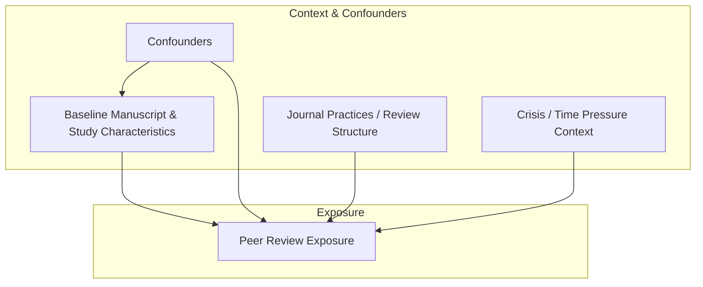
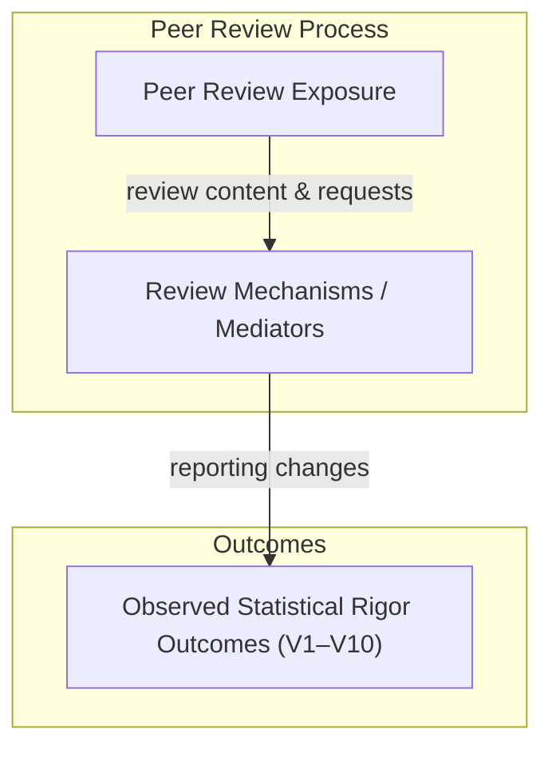
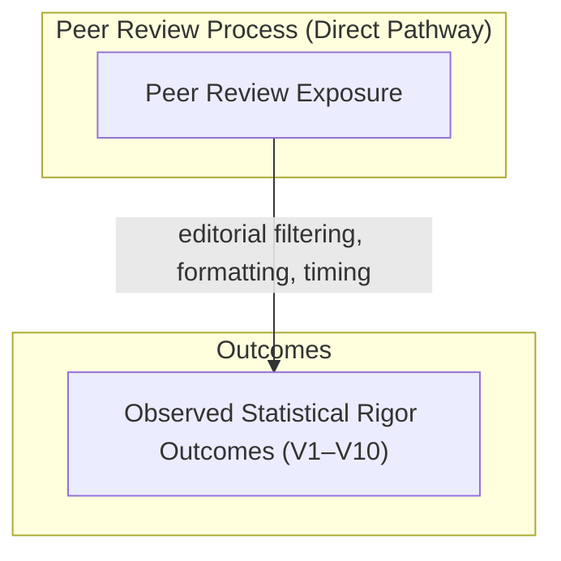

# **Peer-Review Impact Study — Planning & Preregistration**

**Status:** Planning stage  
**Data Accessed:** ❌ No  
**Analysis Performed:** ❌ No  
**Preregistration Lock Date:** _To be set upon planning completion_

---

## 1. Study Overview

This study examines how peer review is **associated with observable changes in statistical rigor** by comparing preprint manuscripts with their corresponding peer-reviewed published versions.

The study is **observational**, **comparative**, and **non-causal**. It does not assume that peer review necessarily improves scientific quality, nor that observed changes are inherently beneficial. Instead, it aims to **quantify what changes**, **in which dimensions**, and **under what contextual conditions**, using preregistered indicators of statistical rigor.

The study prioritizes **transparency, preregistration, and reproducibility**, and explicitly avoids causal attribution.

---

## 2. Research Question

### **RQ-001**

**Does peer review increase statistical rigor between preprint and published versions of manuscripts?**

### Why This Matters

Peer review is widely treated as a quality-assurance mechanism, yet prior evidence suggests its effects on statistical rigor are often **small, heterogeneous, and context-dependent**. Understanding which aspects of rigor change—and which do not—has implications for editorial policy, research evaluation, and the role of preprints in scientific communication.

### Explicit Non-Goals
This study does **not** aim to:
- Estimate the causal effect of peer review
- Assess reviewer intent or reviewer quality
- Rank journals, publishers, or authors
- Evaluate novelty, importance, or writing quality

---

## 3. Core Literature Review (Design-Motivating)

The literature on peer review and preprints consistently shows that **large improvements in statistical outcomes are uncommon**, while **modest improvements in reporting and transparency are more plausible**. Importantly, prior studies differ in scope, metrics, and inferred mechanisms, motivating a preregistered, multi-indicator approach.

### 3.1 Effect Estimates and Stability

Multiple studies report **substantial stability in effect estimates** between preprint and published versions. Davidson et al. 2024 and Nelson et al. 2022 find that peer review rarely reverses effect direction and only modestly alters magnitude, suggesting that **core quantitative results are largely determined prior to review**.

These findings motivate inclusion of **V1 (effect estimates)** while tempering expectations of large average changes.

### 3.2 Reporting Quality and Transparency

Broader improvements are more commonly observed in **statistical reporting practices**.  
Carneiro et al. 2020 and Garcia-Costa et al. 2022 show modest post-review improvements in uncertainty reporting, model clarity, and disclosure, though gains are inconsistent and metric-dependent.

These studies directly motivate **V2, V3, V5, V6, V7, and V9**, emphasizing reporting rather than correctness.

### 3.3 Mechanisms: Why Effects Are Often Small

Evidence suggests that **peer review’s impact depends on structure**, not mere existence.  
Soderberg et al. 2021 demonstrates that **prereview of methods** yields larger rigor gains than conventional post-hoc review.  Lu and Daugherty 2022 further argue that unstructured review is unlikely to substantially improve statistical rigor.

These findings motivate explicit modeling of **review mechanisms and journal practices** as moderators.

### 3.4 Heterogeneity and Boundary Conditions

Several studies caution against treating peer review as uniformly beneficial.  Kodvanj et al. 2022 shows that during crisis conditions, peer-reviewed articles are not consistently more rigorous than preprints, underscoring the role of **time pressure and context**.

This motivates preregistered heterogeneity analysis and inclusion of contextual moderators.

### 3.5 Conceptual and Design Validation

Soderberg et al. 2020 emphasizes separating beliefs about peer review from measurable outcomes.  Zoghbi et al. 2026 confirms that preprint-to-publication comparison is an established study type, while highlighting gaps in multi-metric rigor assessment.

Together, these works justify:
- non-causal framing
- preregistered multi-indicator measurement
- avoidance of single “quality” scores

---
### Literature Review Summary

Prior literature supports the following design premises:
1. **Large effect-size changes are rare**
2. **Reporting and transparency are more malleable than results**
3. **Review structure matters more than review presence**
4. **Context and discipline drive heterogeneity**
5. **No single metric captures peer-review impact**

These premises directly inform variable selection (V1–V10) and the study’s conceptual model.

---

## 4. Conceptual Model (Causal-DAG–Informed, Non-Causal)

Observed changes between preprint and published versions arise from multiple interacting processes. Baseline manuscript characteristics influence both the likelihood and nature of peer review exposure and the level of statistical rigor present prior to review. Peer review, when present, may influence statistical rigor primarily through heterogeneous mechanisms such as requests for clarification, additional analyses, or enforcement of reporting standards. Contextual and institutional factors further moderate these relationships.

Observed differences are interpreted as **associations**, not causal effects.

---

## 5. Formal DAG (Conceptual)

#### 5.1 Exposure Assignment
**Diagram A — Exposure assignment (what determines PR)**


---
#### 5.2 Mediated Peer Review Effects (Primary Estimand)

**Diagram B1 — **Mediated effect of peer review** (PRIMARY) **
 _Estimand:_ total effect of peer review operating **through review mechanisms**


#### 5.3 Direct Peer Review Effects (Secondary / Exploratory)

**Diagram B2 — Direct (non-mediated) effects (SECONDARY / SENSITIVITY)**
> _Estimand:_ controlled direct effect (explicitly exploratory)


#### 5.3.1 Formal DAGitty Specifications (Machine-Readable)

The following DAGitty specifications provide a machine-readable representation of Diagrams B1 and B2 for reproducibility and to enable formal path and adjustment-set checks. These specifications are used for conceptual validation only; the study remains explicitly non-causal.

**Diagram B1 — Mediated Peer Review Effects (Primary)**
```dagitty
dag {
  title: "Diagram B1 — Mediated Peer Review Effects (Primary)"
  PR   [exposure]
  MECH
  Y    [outcome]

  PR -> MECH
  MECH -> Y
}
```

**Diagram B2 — Direct Peer Review Effects (Secondary/Exploratory)**
```dagitty
dag {
  title: "Diagram B2 — Direct Peer Review Effects (Secondary/Exploratory)"
  PR [exposure]
  Y  [outcome]

  PR -> Y
}

```

---

```yaml
If you also want the **Diagram A Dagitty spec** (exposure assignment) to round out Section 5, say so and I’ll generate it in the same style.
::contentReference[oaicite:0]{index=0}
```
## 5.4 DAG-to-Variables Alignment (V1–V10)

This section links each preregistered rigor indicator (V1–V10) to the three conceptual DAGs.

### Diagram A (Exposure Assignment): Relation to V1–V10

Diagram A does not model V1–V10 directly; it specifies determinants of peer review exposure (PR) that motivate covariate adjustment and heterogeneity stratification. V1–V10 are downstream outcomes and are not part of the exposure-assignment diagram.

### Diagram B1 (Mediated Pathway, Primary Estimand): PR → MECH → Y

In Diagram B1, Y is operationalized as the vector of preregistered outcomes (V1–V10). Each indicator is interpreted as a measurable manifestation of changes that may occur through review mechanisms (MECH), such as reviewer requests, editorial checklists, or reporting enforcement.

- V1: Effect estimate change (via reanalysis/model changes)
- V2: Uncertainty reporting (CI/SE/precision requests)
- V3: Significance reporting (p-value transparency/framing changes)
- V4: Power/sample-size justification (requests for rationale)
- V5: Model specification clarity (model/covariate disclosure)
- V6: Multiplicity handling/disclosure (multiple outcomes/tests)
- V7: Robustness checks (sensitivity/subgroup/alt specs)
- V8: Missing-data handling (description of missingness and imputation approaches)
- V9: Transparency and reproducibility (code, data, protocol availability)
- V10: Study design reporting (randomization, blinding, CONSORT/STROBE items)

### Diagram B2 (Direct Pathway, Secondary/Exploratory): PR → Y

Diagram B2 is interpreted narrowly as capturing changes plausibly attributable to journal/editorial requirements or publication-stage constraints that may not be traceable to identifiable reviewer mechanisms. Direct effects are treated as secondary and exploratory, with the strongest plausibility for V9–V10 (journal mandates) and partial plausibility for V3/V5/V8 depending on journal policies.

---
## 6. Operational Definition of Statistical Rigor

Statistical rigor is operationalized as **transparent, interpretable, and reproducible quantitative reporting**, measured using the preregistered indicators V1–V10.

---

## 7. Preregistered Variables (V1–V10)

Each variable is scored **independently** for the preprint and published versions using a predefined 0–2 rubric (Absent / Partial / Clear).

- **V1:** Effect estimate presence and clarity (direction/magnitude)
- **V2:** Uncertainty reporting (CI/CrI/SE)
- **V3:** p-value transparency (exact vs threshold)
- **V4:** Power or sample-size justification
- **V5:** Model and covariate specification clarity
- **V6:** Multiplicity handling or disclosure
- **V7:** Robustness or sensitivity analyses
- **V8:** Missing data
- **V9:** Transparency/reproducibility
- **V10:** Study design reporting

---
## 8. Variable Influence Classification (DAG-Informed)

- **Primarily baseline-driven (M0 → Y):** V1, V4, V8
- **Primarily review-mechanism-driven (PR → MECH → Y):** V2, V5, V9
- **Mixed influence (baseline + review + policy):** V3, V6, V7, V10

Journal practices and crisis context are expected to **moderate** the magnitude of observed change.

---
## 9. Scoring and Composite Measures
### Raw Statistical Rigor Score
- Sum of V1–V10
- Range: 0–20 per manuscript version
### Peer-Review Effect Score (PRES)
`PRES = Published Score − Preprint Score`

### Interpretation (Descriptive)
- ≤ −2 → Apparent rigor regression
- −1 to +1 → No meaningful change
- +2 to +4 → Modest improvement
- ≥ +5 → Substantial improvement

These thresholds are descriptive and non-normative.

---

## 10. Analysis Plan (High-Level)
- Independent scoring of preprint and published versions
- Primary focus on **within-manuscript change**
- Distributional analysis of PRES and per-variable changes
- Exploratory heterogeneity analyses by field, journal practices, and context
- No causal estimands or causal adjustment procedures

---

## 11. Transparency and Deviations
All variables, scoring rules, and analyses are preregistered prior to data access. Any deviations will be explicitly documented, justified, and reported.

---

## 12. Reviewer-Facing Constraint Statement
> This study evaluates observed changes in preregistered indicators of statistical rigor associated with peer review, without estimating causal effects or assuming uniform improvement.
---

## 13. Anticipated Reviewer Concerns (Pre-Response)

| Reviewer Concern                  | Planned Response                                        |
| --------------------------------- | ------------------------------------------------------- |
| “Why this definition of rigor?”   | Conceptual definition fixed prior to operationalization |
| “Why not include X?”              | Explicitly out of scope by preregistered design         |
| “Is this causal?”                 | Observational by epistemic commitment                   |
| “Is peer review assumed to help?” | No directional assumption                               |
| “Why this dataset size?”          | Justified at dataset-freeze stage                       |

---

## 14. Planning Status Declaration

At the time of this export:
- ❌ No datasets have been accessed
- ❌ No metrics have been operationalized
- ❌ No analyses have been conducted

This document constitutes the **complete and final planning record** prior to study execution.

---

## 15. Planning Lock (to be completed)

**Planning Lock Date:** __________________  
**Locked By:** __________________

After lock:
- Changes require explicit decision logs
- Deviations are permitted but never silent

---

## Use of AI-Assisted Tools

AI-assisted tools (including ChatGPT, OpenAI Codex, and JetBrains AI Assistant) were used during the **planning and organizational stages** of this study to support outlining, documentation structuring, and code scaffolding.

No data were analyzed, no results were generated, and no substantive scientific claims or interpretations were produced by these tools. All methodological decisions, definitions, analyses, and interpretations remain the sole responsibility of the authors.