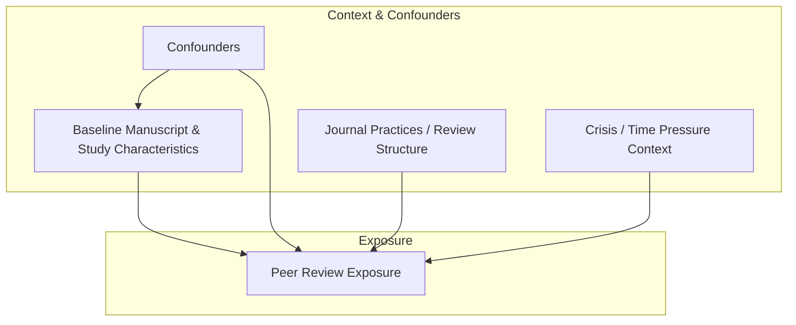
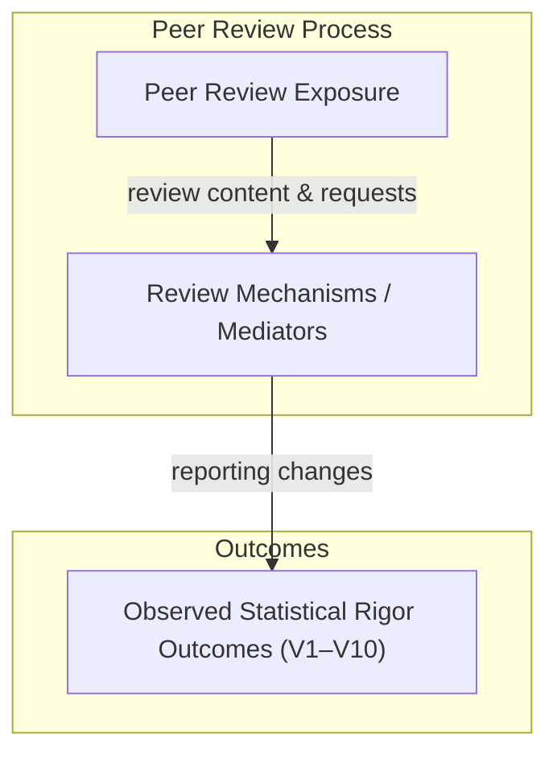
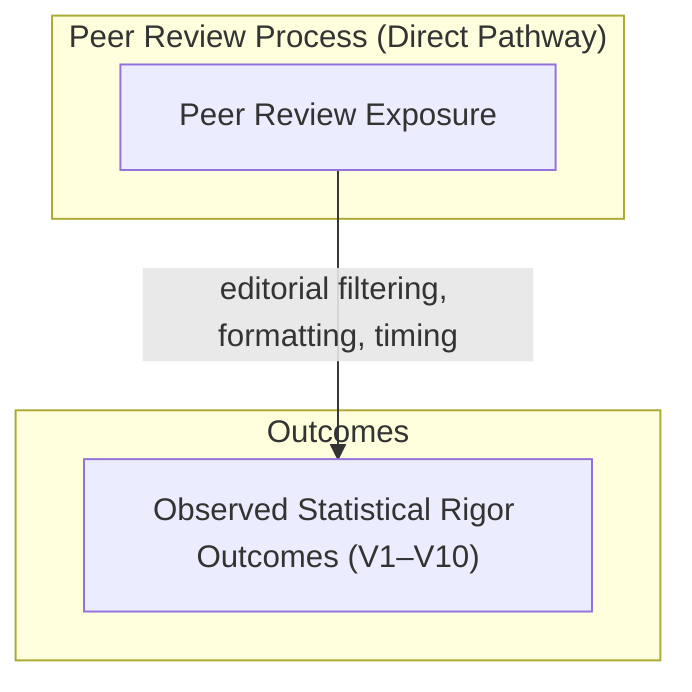

# **Peer-Review Impact Study — Planning & Preregistration**

**Status:** Planning stage  
**Data Accessed:** ❌ No  
**Analysis Performed:** ❌ No  
**Preregistration Lock Date:** _To be set upon planning completion_

---

## 1. Study Overview

This study examines how peer review is **associated with observable changes in statistical rigor** by comparing preprint manuscripts with their corresponding peer-reviewed published versions.

The study is **observational**, **comparative**, and **non-causal**. It does not assume that peer review necessarily improves scientific quality, nor that observed changes are inherently beneficial. Instead, it aims to **quantify what changes**, **in which dimensions**, and **under what contextual conditions**, using preregistered indicators of statistical rigor.

The study prioritizes **transparency, preregistration, and reproducibility**, and explicitly avoids causal attribution.

---

## 2. Research Question

### **RQ-001**

**Does peer review increase statistical rigor between preprint and published versions of manuscripts?**

### Why This Matters

Peer review is widely treated as a quality-assurance mechanism, yet prior evidence suggests its effects on statistical rigor are often **small, heterogeneous, and context-dependent**. Understanding which aspects of rigor change—and which do not—has implications for editorial policy, research evaluation, and the role of preprints in scientific communication.

### Explicit Non-Goals
This study does **not** aim to:
- Estimate the causal effect of peer review
- Assess reviewer intent or reviewer quality
- Rank journals, publishers, or authors
- Evaluate novelty, importance, or writing quality

### Interpretation of Null Findings.

**Null findings are substantively informative in this context.** Peer review is widely assumed to improve statistical
rigor; observing no systematic change challenges that assumption and places empirical bounds on the magnitude and
consistency of peer review’s influence in practice. Such stability suggests that core statistical decisions are often
determined prior to review and that meaningful improvements, where they occur, are likely heterogeneous and dependent on
review structure and context rather than review presence alone. Peer review is widely assumed to improve statistical
rigor; observing no systematic change challenges that assumption and places empirical bounds on the magnitude and
consistency of peer review’s influence in practice. Such stability suggests that core statistical decisions are often
determined prior to review and that meaningful improvements, where they occur, are likely heterogeneous and dependent on
review structure and context rather than review presence alone.
 
---

## 3. Core Literature Review (Design-Motivating)

The literature on peer review and preprints consistently shows that **large improvements in statistical outcomes are uncommon**, while **modest improvements in reporting and transparency are more plausible**. Importantly, prior studies differ in scope, metrics, and inferred mechanisms, motivating a preregistered, multi-indicator approach.

### 3.1 Effect Estimates and Stability

Multiple studies report **substantial stability in effect estimates** between preprint and published versions. Davidson et al. 2024 and Nelson et al. 2022 find that peer review rarely reverses effect direction and only modestly alters magnitude, suggesting that **core quantitative results are largely determined prior to review**.

These findings motivate inclusion of **V1 (effect estimates)** while tempering expectations of large average changes.

### 3.2 Reporting Quality and Transparency

Broader improvements are more commonly observed in **statistical reporting practices**.  
Carneiro et al. 2020 and Garcia-Costa et al. 2022 show modest post-review improvements in uncertainty reporting, model clarity, and disclosure, though gains are inconsistent and metric-dependent.

These studies directly motivate **V2, V3, V5, V6, V7, and V9**, emphasizing reporting rather than correctness.

### 3.3 Mechanisms: Why Effects Are Often Small

Evidence suggests that **peer review’s impact depends on structure**, not mere existence.  
Soderberg et al. 2021 demonstrates that **prereview of methods** yields larger rigor gains than conventional post-hoc review.  Lu and Daugherty 2022 further argue that unstructured review is unlikely to substantially improve statistical rigor.

These findings motivate explicit modeling of **review mechanisms and journal practices** as moderators.

### 3.4 Heterogeneity and Boundary Conditions

Several studies caution against treating peer review as uniformly beneficial.  Kodvanj et al. 2022 shows that during crisis conditions, peer-reviewed articles are not consistently more rigorous than preprints, underscoring the role of **time pressure and context**.

This motivates preregistered heterogeneity analysis and inclusion of contextual moderators.

### 3.5 Conceptual and Design Validation

Soderberg et al. 2020 emphasizes separating beliefs about peer review from measurable outcomes.  Zoghbi et al. 2026 confirms that preprint-to-publication comparison is an established study type, while highlighting gaps in multi-metric rigor assessment.

Together, these works justify:
- non-causal framing
- preregistered multi-indicator measurement
- avoidance of single “quality” scores

---
### Literature Review Summary

Prior literature supports the following design premises:
1. **Large effect-size changes are rare**
2. **Reporting and transparency are more malleable than results**
3. **Review structure matters more than review presence**
4. **Context and discipline drive heterogeneity**
5. **No single metric captures peer-review impact**

These premises directly inform variable selection (V1–V10) and the study’s conceptual model.

---

## 4. Conceptual Model (Causal-DAG–Informed, Non-Causal)

Observed changes between preprint and published versions arise from multiple interacting processes. Baseline manuscript characteristics influence both the likelihood and nature of peer review exposure and the level of statistical rigor present prior to review. Peer review, when present, may influence statistical rigor primarily through heterogeneous mechanisms such as requests for clarification, additional analyses, or enforcement of reporting standards. Contextual and institutional factors further moderate these relationships.

Observed differences are interpreted as **associations**, not causal effects.

---

## 5. Formal DAG (Conceptual)

#### 5.1 Exposure Assignment
**Diagram A — Exposure assignment (what determines PR)**


---
#### 5.2 Mediated Peer Review Effects (Primary Estimand)

**Diagram B1 — Mediated Effect of Peer Review (Primary)**
 _Estimand:_ total effect of peer review operating **through review mechanisms**


#### 5.3 Direct Peer Review Effects (Secondary / Exploratory)

**Diagram B2 — Direct (Non-Mediated) Peer Review Effects (Secondary / Exploratory)**
> _Estimand:_ controlled direct effect (explicitly exploratory)


#### 5.3.1 Formal DAGitty Specifications (Machine-Readable)

The following DAGitty specifications provide a machine-readable representation of Diagrams B1 and B2 for reproducibility and to enable formal path and adjustment-set checks. These specifications are used for conceptual validation only; the study remains explicitly non-causal.

**Diagram B1 — Mediated Peer Review Effects (Primary)**
```dagitty
dag {
  title: "Diagram B1 — Mediated Peer Review Effects (Primary)"
  PR   [exposure]
  MECH
  Y    [outcome]

  PR -> MECH
  MECH -> Y
}
```

**Diagram B2 — Direct Peer Review Effects (Secondary/Exploratory)**
```dagitty
dag {
  title: "Diagram B2 — Direct Peer Review Effects (Secondary/Exploratory)"
  PR [exposure]
  Y  [outcome]

  PR -> Y
}

```

---

```yaml
If you also want the **Diagram A Dagitty spec** (exposure assignment) to round out Section 5, say so and I’ll generate it in the same style.
::contentReference[oaicite:0]{index=0}
```
## 5.4 DAG-to-Variables Alignment (V1–V10)

This section links each preregistered rigor indicator (V1–V10) to the three conceptual DAGs.

### Diagram A (Exposure Assignment): Relation to V1–V10

Diagram A does not model V1–V10 directly; it specifies determinants of peer review exposure (PR) that motivate covariate adjustment and heterogeneity stratification. V1–V10 are downstream outcomes and are not part of the exposure-assignment diagram.

### Diagram B1 (Mediated Pathway, Primary Estimand): PR → MECH → Y

In Diagram B1, Y is operationalized as the vector of preregistered outcomes (V1–V10). Each indicator is interpreted as a measurable manifestation of changes that may occur through review mechanisms (MECH), such as reviewer requests, editorial checklists, or reporting enforcement.

- V1: Effect estimate change (via reanalysis/model changes)
- V2: Uncertainty reporting (CI/SE/precision requests)
- V3: Significance reporting (p-value transparency/framing changes)
- V4: Power/sample-size justification (requests for rationale)
- V5: Model specification clarity (model/covariate disclosure)
- V6: Multiplicity handling/disclosure (multiple outcomes/tests)
- V7: Robustness checks (sensitivity/subgroup/alt specs)
- V8: Missing-data handling (description of missingness and imputation approaches)
- V9: Transparency and reproducibility (code, data, protocol availability)
- V10: Study design reporting (randomization, blinding, CONSORT/STROBE items)

### Diagram B2 (Direct Pathway, Secondary/Exploratory): PR → Y

Diagram B2 is interpreted narrowly as capturing changes plausibly attributable to journal/editorial requirements or publication-stage constraints that may not be traceable to identifiable reviewer mechanisms. Direct effects are treated as secondary and exploratory, with the strongest plausibility for V9–V10 (journal mandates) and partial plausibility for V3/V5/V8 depending on journal policies.

---
## 6. Operational Definition of Statistical Rigor

Statistical rigor is operationalized as **transparent, interpretable, and reproducible quantitative reporting**, measured using the preregistered indicators V1–V10.

---

## 7. Preregistered Variables (V1–V10)

Each variable is scored **independently** for the preprint and published versions using a predefined 0–2 rubric (Absent / Partial / Clear).

- **V1:** Effect estimate presence and clarity (direction/magnitude)
- **V2:** Uncertainty reporting (CI/CrI/SE)
- **V3:** p-value transparency (exact vs threshold)
- **V4:** Power or sample-size justification
- **V5:** Model and covariate specification clarity
- **V6:** Multiplicity handling or disclosure
- **V7:** Robustness or sensitivity analyses
- **V8:** Missing data
- **V9:** Transparency/reproducibility
- **V10:** Study design reporting

---
## 8. Variable Influence Classification (DAG-Informed)

- **Primarily baseline-driven (M0 → Y):** V1, V4, V8
- **Primarily review-mechanism-driven (PR → MECH → Y):** V2, V5, V9
- **Mixed influence (baseline + review + policy):** V3, V6, V7, V10

Journal practices and crisis context are expected to **moderate** the magnitude of observed change.

---
## 9. Scoring and Composite Measures
### Raw Statistical Rigor Score
- Sum of V1–V10
- Range: 0–20 per manuscript version
### Peer-Review Effect Score (PRES)
`PRES = Published Score − Preprint Score`

### Interpretation (Descriptive)
- ≤ −2 → Apparent rigor regression
- −1 to +1 → No meaningful change
- +2 to +4 → Modest improvement
- ≥ +5 → Substantial improvement

These thresholds are heuristic and descriptive summaries only and are not used for hypothesis testing or inferential
decision-making.

---

## 10. Analysis Plan (High-Level)
- Independent scoring of preprint and published versions
- Primary focus on **within-manuscript change**
- Distributional analysis of PRES and per-variable changes
- Exploratory heterogeneity analyses by field, journal practices, and context
- No causal estimands or causal adjustment procedures

---
### **10.1 Hypotheses (Null + Directional Expectations)**

**Primary null hypotheses (per indicator):** For each preregistered rigor indicator VkV_kVk​ (k = 1…10), the within-manuscript change from preprint to published version is zero on average.

Let ΔVk=Vk, published−Vk, preprint\Delta V_k = V_{k,\ published} - V_{k,\ preprint}ΔVk​=Vk, published​−Vk, preprint​.

- **H0(V1):** E[ΔV1]=0E[\Delta V_1] = 0E[ΔV1​]=0 (no systematic change in effect estimates)
    
- **H0(V2):** E[ΔV2]=0E[\Delta V_2] = 0E[ΔV2​]=0 (no systematic change in uncertainty reporting)
    
- **H0(V3):** E[ΔV3]=0E[\Delta V_3] = 0E[ΔV3​]=0 (no systematic change in significance reporting transparency)
    
- **H0(V4):** E[ΔV4]=0E[\Delta V_4] = 0E[ΔV4​]=0 (no systematic change in power/sample-size justification)
    
- **H0(V5):** E[ΔV5]=0E[\Delta V_5] = 0E[ΔV5​]=0 (no systematic change in model/spec clarity)
    
- **H0(V6):** E[ΔV6]=0E[\Delta V_6] = 0E[ΔV6​]=0 (no systematic change in multiplicity handling/disclosure)
    
- **H0(V7):** E[ΔV7]=0E[\Delta V_7] = 0E[ΔV7​]=0 (no systematic change in robustness checks)
    
- **H0(V8):** E[ΔV8]=0E[\Delta V_8] = 0E[ΔV8​]=0 (no systematic change in missing data reporting/handling)
    
- **H0(V9):** E[ΔV9]=0E[\Delta V_9] = 0E[ΔV9​]=0 (no systematic change in transparency/reproducibility)
    
- **H0(V10):** E[ΔV10]=0E[\Delta V_{10}] = 0E[ΔV10​]=0 (no systematic change in design reporting)
    

**Secondary global null hypothesis (composite):**  
Let PRES=∑k=110Vk, published−∑k=110Vk, preprintPRES = \sum_{k=1}^{10} V_{k,\ published} - \sum_{k=1}^{10} V_{k,\ preprint}PRES=∑k=110​Vk, published​−∑k=110​Vk, preprint​.

- **H0(Global):** E[PRES]=0E[PRES] = 0E[PRES]=0.
    

**Exploratory moderator nulls:** The distribution of ΔVk\Delta V_kΔVk​ does not differ by preregistered contextual moderators (e.g., journal practices/review structure, discipline, crisis/time-pressure context).

Null or near-zero average changes are considered substantively informative and are interpreted as evidence about the
practical limits and heterogeneity of peer review’s influence.

---

### **10.2 Measurement & Scoring Procedure (Quantifying V1–V10)**

Each manuscript is evaluated as a **paired unit** (preprint vs published). For each version, each indicator V1V1V1–V10V10V10 is scored on a **0–2 rubric** (Absent / Partial / Clear) using a preregistered codebook. Outcomes are computed as within-pair differences ΔVk\Delta V_kΔVk​ and summarized descriptively and inferentially.

**Core steps:**

1. **Pairing and eligibility:** preprint–published matching rules; Methods/Results must be accessible.
    
2. **Extraction:** structured extraction from PDF/HTML (sections, tables, key statistical patterns).
    
3. **Scoring:** independent scoring of each version using anchored definitions; record evidence snippets.
    
4. **Change computation:** ΔVk\Delta V_kΔVk​ for each indicator and PRESPRESPRES for composite change.
    
5. **Reliability:** double-coding of a preregistered subset; inter-rater reliability reported; adjudication rules documented.

**NB:** Variable-specific operational definitions are enumerated in Section 7 and expanded in the codebook appendix.”


---
## 11. Document Access, Format Handling, and Eligibility

### 11.1 Source Hierarchy and Extraction Rules

Articles are evaluated using the **most complete and stable full-text representation available at the time of analysis**. Document format is treated as a content container rather than a quality signal.

The following extraction hierarchy is applied consistently to both preprint and published versions:

1. **Publisher-provided PDF** (preferred when available and machine-readable)
    
2. **Publisher-provided full-text HTML** (used when a PDF is unavailable, inaccessible, or non-existent)
    
3. **Supplementary materials** (used to clarify or complete reporting, but not as substitutes for missing core sections)
    

Abstract-only pages, truncated previews, or partial text views are not considered sufficient for evaluation.

---

### 11.2 Use of Supplementary Materials

Supplementary materials (e.g., appendices, CONSORT/STROBE checklists, supplementary methods) may be consulted to **supplement** reporting indicators but are not used as replacements for missing core content.

Supplementary materials may increase a reporting score only when they provide clear, explicit information relevant to a preregistered indicator. The absence of reporting in the main text is not compensated for by vague or incomplete supplementary references.

---

### 11.3 Symmetry Between Preprint and Published Versions

The same document access and extraction rules are applied **symmetrically** to preprint and published versions of each manuscript. No additional effort or alternative access methods are used for one version but not the other.

This symmetry ensures that observed differences reflect changes in reporting content rather than differential document availability.

---

### 11.4 Exclusion Criteria Related to Document Access

Manuscripts are excluded from analysis only when:

- Neither a full-text PDF nor a complete full-text HTML version is accessible, **or**
    
- Core sections required for scoring (Methods and Results) are unavailable or unreadable.
    

All exclusions are logged with explicit reasons. Counts of excluded manuscripts due to document access limitations are reported transparently.

---

### 11.5 Format Metadata and Sensitivity Tracking

For each manuscript version, the following metadata are recorded:

- Document format used (PDF, HTML, or mixed)
    
- PDF availability (yes/no)
    
- Use of supplementary materials (yes/no)
    
- Exclusion status and reason (if applicable)
    

Document format is not treated as a rigor indicator. However, document format metadata may be used in **descriptive or sensitivity analyses** to assess whether reporting patterns differ systematically by format.
## 12. Transparency and Deviations
All variables, scoring rules, and analyses are preregistered prior to data access. Any deviations will be explicitly documented, justified, and reported.

---

## 13. Reviewer-Facing Constraint Statement
> This study evaluates observed changes in preregistered indicators of statistical rigor associated with peer review, without estimating causal effects or assuming uniform improvement.
---

## 14. Anticipated Reviewer Concerns (Pre-Response)

| Reviewer Concern                  | Planned Response                                        |
| --------------------------------- | ------------------------------------------------------- |
| “Why this definition of rigor?”   | Conceptual definition fixed prior to operationalization |
| “Why not include X?”              | Explicitly out of scope by preregistered design         |
| “Is this causal?”                 | Observational by epistemic commitment                   |
| “Is peer review assumed to help?” | No directional assumption                               |
| “Why this dataset size?”          | Justified at dataset-freeze stage                       |

---

## 15. Planning Status Declaration

At the time of this export:
- ❌ No datasets have been accessed
- ❌ No metrics have been operationalized
- ❌ No analyses have been conducted

This document constitutes the **complete and final planning record** prior to study execution.

---

## 16. Planning Lock (to be completed)

**Planning Lock Date:** __________________  
**Locked By:** __________________

After lock:
- Changes require explicit decision logs
- Deviations are permitted but never silent

---

## Use of AI-Assisted Tools

AI-assisted tools (including ChatGPT, OpenAI Codex, and JetBrains AI Assistant) were used during the **planning and organizational stages** of this study to support outlining, documentation structuring, and code scaffolding.

No data were analyzed, no results were generated, and no substantive scientific claims or interpretations were produced by these tools. All methodological decisions, definitions, analyses, and interpretations remain the sole responsibility of the authors.

# **Appendix A: Preregistered Codebook for Statistical Rigor Indicators (V1–V10)**

This appendix defines the **operational scoring rules** used to quantify preregistered indicators of statistical rigor (V1–V10). All indicators are scored **independently** for the preprint and published versions of each manuscript prior to computing within-manuscript change scores.

Scoring is based exclusively on **observable reporting content** in the manuscript and eligible supplementary materials, following the access rules defined in Section 11.

---

## A.1 General Scoring Principles

- Each indicator is scored on a **0–2 ordinal scale**:
    
    - **0 = Absent**
        
    - **1 = Partial / Incomplete**
        
    - **2 = Clear / Complete**
        
- Scores reflect **presence and clarity of reporting**, not correctness or appropriateness.
    
- Indicators are evaluated **symmetrically** for preprint and published versions.
    
- Evidence supporting each score is logged using **verbatim excerpts, tables, or figure references**.
    
- When ambiguity exists, the **lower score is assigned**.
    
- No indicator score may be inferred or assumed.
    

---

## A.2 Unit of Analysis

- **Primary unit:** matched manuscript pair (preprint vs published).
    
- Each version is scored separately before computing:
    
    ΔVk=Vk, published−Vk, preprint\Delta V_k = V_{k,\ published} - V_{k,\ preprint}ΔVk​=Vk, published​−Vk, preprint​

---

## A.3 Indicator-Specific Definitions and Scoring Criteria

### **V1 — Effect Estimate Reporting**

**Definition:** Clarity and completeness of primary quantitative effect estimates.

**Evidence sources:** Results text, outcome tables, figures.

|Score|Criteria|
|---|---|
|0|No explicit effect estimate reported|
|1|Effect estimate reported but incomplete (direction only, unclear scale, or missing magnitude)|
|2|Effect estimate clearly reported with direction and magnitude on a defined scale|

**Notes:**

- Changes in effect size are recorded descriptively; no normative judgment is made.
    
- Outcome switching is logged but does not alter the score.
    

---

### **V2 — Uncertainty Reporting**

**Definition:** Reporting of uncertainty around effect estimates.

**Evidence sources:** Confidence intervals, credible intervals, standard errors.

|Score|Criteria|
|---|---|
|0|No uncertainty reported|
|1|Uncertainty reported for some but not all primary estimates|
|2|Uncertainty consistently reported for primary estimates|

---

### **V3 — Significance Reporting Transparency**

**Definition:** Precision and transparency of statistical significance reporting.

**Evidence sources:** p-values, hypothesis test statements.

|Score|Criteria|
|---|---|
|0|No p-values or inferential statistics reported|
|1|Threshold-only reporting (e.g., p<0.05)|
|2|Exact p-values reported|

---

### **V4 — Power or Sample Size Justification**

**Definition:** Presence and detail of a priori sample size or power justification.

**Evidence sources:** Methods section, supplementary methods.

|Score|Criteria|
|---|---|
|0|No power or sample size rationale|
|1|Mentioned without parameters|
|2|Explicit calculation with stated assumptions (e.g., alpha, power, effect size)|

---

### **V5 — Model and Specification Clarity**

**Definition:** Transparency of statistical model specification.

**Evidence sources:** Methods section.

|Score|Criteria|
|---|---|
|0|Model unspecified or vague|
|1|Model named but covariates or assumptions unclear|
|2|Model, covariates, and assumptions clearly specified|

---

### **V6 — Multiplicity Handling or Disclosure**

**Definition:** Acknowledgment and handling of multiple outcomes or comparisons.

**Evidence sources:** Methods, Results, footnotes.

|Score|Criteria|
|---|---|
|0|No mention of multiplicity|
|1|Multiplicity acknowledged without correction|
|2|Explicit correction or prespecified outcome hierarchy|

---

### **V7 — Robustness or Sensitivity Analyses**

**Definition:** Reporting of analyses assessing robustness of results.

**Evidence sources:** Results, supplementary analyses.

|Score|Criteria|
|---|---|
|0|No robustness checks|
|1|Single or limited robustness analysis|
|2|Multiple or systematic robustness analyses|

---

### **V8 — Missing Data Reporting and Handling**

**Definition:** Transparency of missing data description and handling.

**Evidence sources:** Methods, Results.

|Score|Criteria|
|---|---|
|0|Missing data not addressed|
|1|Missingness described without method|
|2|Missingness described with explicit handling method|

---

### **V9 — Transparency and Reproducibility**

**Definition:** Availability of materials enabling independent verification.

**Evidence sources:** Data/code availability statements, protocol links.

|Score|Criteria|
|---|---|
|0|No transparency statement|
|1|Statement present but materials inaccessible|
|2|Accessible data, code, or protocol provided|

---

### **V10 — Study Design Reporting**

**Definition:** Completeness of design-related reporting appropriate to study type.

**Evidence sources:** Methods, flow diagrams, checklists.

|Score|Criteria|
|---|---|
|0|Key design elements missing|
|1|Partial reporting|
|2|Comprehensive reporting (e.g., CONSORT/STROBE-aligned)|

---

## A.4 Composite Measures

- **Raw Statistical Rigor Score:**
    
    ∑k=110Vk(0–20)\sum_{k=1}^{10} V_k \quad (0–20)k=1∑10​Vk​(0–20)
- **Peer-Review Effect Score (PRES):**
    
    PRES=∑Vk, published−∑Vk, preprintPRES = \sum V_{k,\ published} - \sum V_{k,\ preprint}PRES=∑Vk, published​−∑Vk, preprint​

Composite scores are **descriptive summaries** and do not replace per-indicator analyses.

---

## A.5 Reliability and Adjudication

- A preregistered subset of manuscripts will be independently double-coded.
    
- Inter-rater reliability will be reported using appropriate statistics.
    
- Discrepancies are resolved via adjudication using the codebook criteria.
    
- Codebook revisions are not permitted after planning lock.
    

---

## A.6 Deviations and Audit Trail

- Any deviations from these scoring rules will be explicitly logged and justified.
    
- All indicator scores are accompanied by evidence excerpts to enable auditability.

---

# **Appendix B: Machine-Readable Codebook (YAML)**

```yaml
codebook:
  name: "Peer-Review Impact Study — Statistical Rigor Indicators"
  version: "1.0.0"
  locked_at: null
  scoring_scale:
    type: ordinal
    levels:
      0: "Absent"
      1: "Partial"
      2: "Clear"

  unit_of_analysis:
    type: "manuscript_pair"
    description: "Matched preprint–published manuscript pair"

  general_rules:
    - "Score preprint and published versions independently"
    - "Use observable reporting only; do not infer intent or correctness"
    - "When ambiguous, assign the lower score"
    - "Evidence snippets must be logged for every score"
    - "Supplementary materials may supplement but not replace missing core content"

  indicators:

    V1:
      name: "Effect Estimate Reporting"
      construct: "Clarity of reported quantitative effect estimates"
      evidence_sources:
        - "Results section"
        - "Outcome tables"
        - "Figures"
      scoring:
        0: "No explicit effect estimate reported"
        1: "Effect estimate reported but incomplete (direction only or unclear scale)"
        2: "Effect estimate clearly reported with direction and magnitude on a defined scale"
      delta_metric:
        type: "ordinal_difference"
        formula: "V1_published - V1_preprint"
      notes:
        - "Effect size changes are descriptive only"
        - "Outcome switching logged separately"

    V2:
      name: "Uncertainty Reporting"
      construct: "Reporting of uncertainty around effect estimates"
      evidence_sources:
        - "Confidence intervals"
        - "Credible intervals"
        - "Standard errors"
      scoring:
        0: "No uncertainty reported"
        1: "Uncertainty reported for some primary estimates"
        2: "Uncertainty consistently reported for primary estimates"
      delta_metric:
        type: "ordinal_difference"

    V3:
      name: "Significance Reporting Transparency"
      construct: "Precision of inferential reporting"
      evidence_sources:
        - "p-values"
        - "Hypothesis test statements"
      scoring:
        0: "No inferential statistics reported"
        1: "Threshold-only reporting (e.g., p < 0.05)"
        2: "Exact p-values reported"
      delta_metric:
        type: "ordinal_difference"

    V4:
      name: "Power or Sample Size Justification"
      construct: "A priori justification of sample size"
      evidence_sources:
        - "Methods section"
        - "Supplementary methods"
      scoring:
        0: "No power or sample size rationale"
        1: "Mentioned without parameters"
        2: "Explicit calculation with stated assumptions"
      delta_metric:
        type: "ordinal_difference"

    V5:
      name: "Model and Specification Clarity"
      construct: "Transparency of statistical model specification"
      evidence_sources:
        - "Methods section"
      scoring:
        0: "Model unspecified or vague"
        1: "Model named but covariates or assumptions unclear"
        2: "Model, covariates, and assumptions clearly specified"
      delta_metric:
        type: "ordinal_difference"

    V6:
      name: "Multiplicity Handling or Disclosure"
      construct: "Acknowledgment and handling of multiple comparisons"
      evidence_sources:
        - "Methods section"
        - "Results section"
        - "Footnotes"
      scoring:
        0: "No mention of multiplicity"
        1: "Multiplicity acknowledged without correction"
        2: "Explicit correction or prespecified outcome hierarchy"
      delta_metric:
        type: "ordinal_difference"

    V7:
      name: "Robustness or Sensitivity Analyses"
      construct: "Assessment of result robustness"
      evidence_sources:
        - "Results section"
        - "Supplementary analyses"
      scoring:
        0: "No robustness checks"
        1: "Single or limited robustness analysis"
        2: "Multiple or systematic robustness analyses"
      delta_metric:
        type: "ordinal_difference"

    V8:
      name: "Missing Data Reporting and Handling"
      construct: "Transparency of missing data treatment"
      evidence_sources:
        - "Methods section"
        - "Results section"
      scoring:
        0: "Missing data not addressed"
        1: "Missingness described without method"
        2: "Missingness described with explicit handling method"
      delta_metric:
        type: "ordinal_difference"

    V9:
      name: "Transparency and Reproducibility"
      construct: "Availability of materials enabling verification"
      evidence_sources:
        - "Data availability statements"
        - "Code availability statements"
        - "Protocol links"
      scoring:
        0: "No transparency statement"
        1: "Statement present but materials inaccessible"
        2: "Accessible data, code, or protocol provided"
      delta_metric:
        type: "ordinal_difference"

    V10:
      name: "Study Design Reporting"
      construct: "Completeness of study design reporting"
      evidence_sources:
        - "Methods section"
        - "Flow diagrams"
        - "CONSORT/STROBE checklists"
      scoring:
        0: "Key design elements missing"
        1: "Partial reporting"
        2: "Comprehensive reporting appropriate to study type"
      delta_metric:
        type: "ordinal_difference"

  composite_scores:
    raw_statistical_rigor:
      description: "Sum of V1–V10 per manuscript version"
      range: [0, 20]
    PRES:
      description: "Peer-Review Effect Score"
      formula: "sum(V_published) - sum(V_preprint)"
      interpretation:
        - range: "≤ -2"
          label: "Apparent rigor regression"
        - range: "-1 to +1"
          label: "No meaningful change"
        - range: "+2 to +4"
          label: "Modest improvement"
        - range: "≥ +5"
          label: "Substantial improvement"

  reliability:
    double_coding_required: true
    adjudication_required: true
    post_lock_modifications_allowed: false
```
