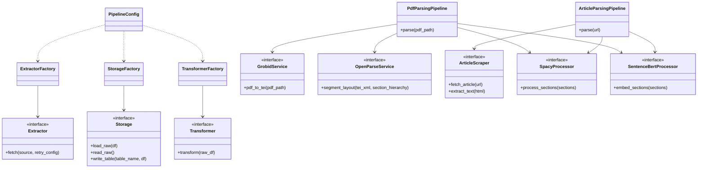
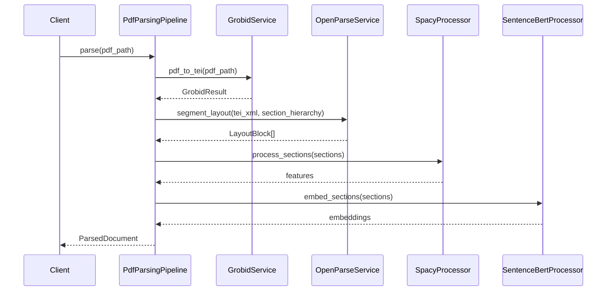
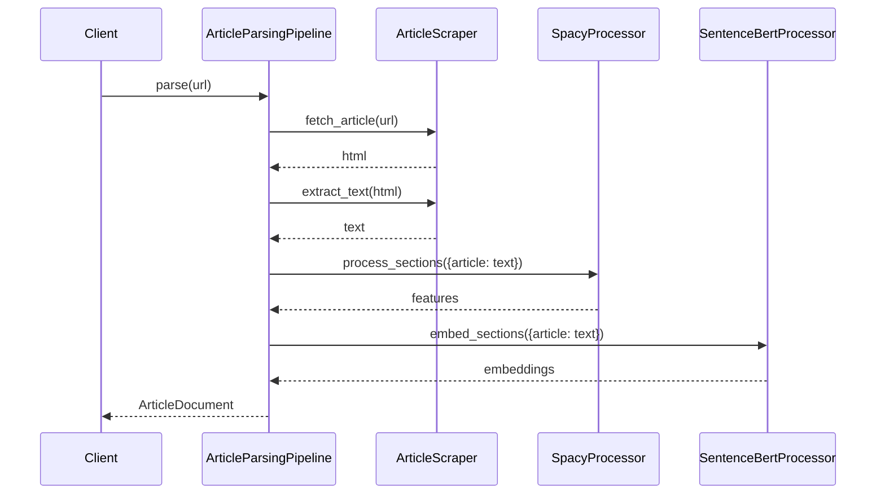

# UML Diagrams

## Pipeline Component Overview (Class Diagram)

```mermaid
classDiagram
    class Extractor {
        <<interface>>
        +fetch(source, retry_config)
    }

    class Storage {
        <<interface>>
        +load_raw(df)
        +read_raw()
        +write_table(table_name, df)
    }

    class Transformer {
        <<interface>>
        +transform(raw_df)
    }

    class PipelineConfig
    class ExtractorFactory
    class StorageFactory
    class TransformerFactory

    class PdfParsingPipeline {
        +parse(pdf_path)
    }

    class ArticleParsingPipeline {
        +parse(url)
    }

    class GrobidService {
        <<interface>>
        +pdf_to_tei(pdf_path)
    }

    class OpenParseService {
        <<interface>>
        +segment_layout(tei_xml, section_hierarchy)
    }

    class ArticleScraper {
        <<interface>>
        +fetch_article(url)
        +extract_text(html)
    }

    class SpacyProcessor {
        <<interface>>
        +process_sections(sections)
    }

    class SentenceBertProcessor {
        <<interface>>
        +embed_sections(sections)
    }

    ExtractorFactory --> Extractor
    StorageFactory --> Storage
    TransformerFactory --> Transformer

    PdfParsingPipeline --> GrobidService
    PdfParsingPipeline --> OpenParseService
    PdfParsingPipeline --> SpacyProcessor
    PdfParsingPipeline --> SentenceBertProcessor

    ArticleParsingPipeline --> ArticleScraper
    ArticleParsingPipeline --> SpacyProcessor
    ArticleParsingPipeline --> SentenceBertProcessor

    PipelineConfig ..> ExtractorFactory
    PipelineConfig ..> StorageFactory
    PipelineConfig ..> TransformerFactory
```

## PDF Parsing Sequence (Sequence Diagram)

```mermaid
sequenceDiagram
    participant Client
    participant PdfParsingPipeline
    participant GrobidService
    participant OpenParseService
    participant SpacyProcessor
    participant SentenceBertProcessor

    Client->>PdfParsingPipeline: parse(pdf_path)
    PdfParsingPipeline->>GrobidService: pdf_to_tei(pdf_path)
    GrobidService-->>PdfParsingPipeline: GrobidResult
    PdfParsingPipeline->>OpenParseService: segment_layout(tei_xml, section_hierarchy)
    OpenParseService-->>PdfParsingPipeline: LayoutBlock[]
    PdfParsingPipeline->>SpacyProcessor: process_sections(sections)
    SpacyProcessor-->>PdfParsingPipeline: features
    PdfParsingPipeline->>SentenceBertProcessor: embed_sections(sections)
    SentenceBertProcessor-->>PdfParsingPipeline: embeddings
    PdfParsingPipeline-->>Client: ParsedDocument
```

## Article Scraping Sequence (Sequence Diagram)

```mermaid
sequenceDiagram
    participant Client
    participant ArticleParsingPipeline
    participant ArticleScraper
    participant SpacyProcessor
    participant SentenceBertProcessor

    Client->>ArticleParsingPipeline: parse(url)
    ArticleParsingPipeline->>ArticleScraper: fetch_article(url)
    ArticleScraper-->>ArticleParsingPipeline: html
    ArticleParsingPipeline->>ArticleScraper: extract_text(html)
    ArticleScraper-->>ArticleParsingPipeline: text
    ArticleParsingPipeline->>SpacyProcessor: process_sections({article: text})
    SpacyProcessor-->>ArticleParsingPipeline: features
    ArticleParsingPipeline->>SentenceBertProcessor: embed_sections({article: text})
    SentenceBertProcessor-->>ArticleParsingPipeline: embeddings
    ArticleParsingPipeline-->>Client: ArticleDocument
```
