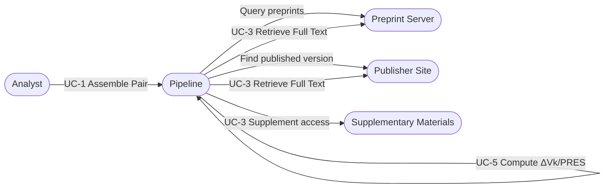
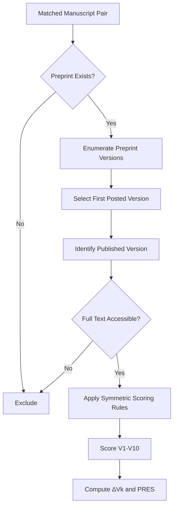

# Use Cases (Derived from the Peer Review Planning Document)

This document translates the preregistered rules in the peer review planning document into concrete user-facing use cases and visual diagrams. The use cases focus on document access, eligibility screening, and version selection workflows defined in the preregistration.

## Actors

- **Analyst**: Runs the pipeline and reviews outputs.
- **Pipeline**: The automated workflow that applies preregistered rules.
- **Preprint Server**: Source of preprint versions (bioRxiv/medRxiv).
- **Publisher Site**: Source of the peer-reviewed published version.
- **Archive/Supplements**: Source of supplementary materials.

## Use Cases

### UC-1: Assemble Matched Manuscript Pair

**Goal:** Identify a preprint and its corresponding published version.

**Primary Actor:** Analyst

**Preconditions:** Preprint metadata is available from bioRxiv/medRxiv within the preregistered date window.

**Main Flow:**
1. Analyst triggers corpus assembly for bioRxiv/medRxiv preprints.
2. Pipeline locates a candidate published version linked to the preprint.
3. Pipeline stores a matched manuscript pair for further processing.

**Postconditions:** A matched pair (preprint + published) is queued for eligibility checks.

---

### UC-2: Select Preprint Version Baseline

**Goal:** Choose the correct preprint version for comparison.

**Primary Actor:** Pipeline

**Preconditions:** Multiple preprint versions exist for a manuscript.

**Main Flow:**
1. Pipeline enumerates all available preprint versions.
2. Pipeline selects the first publicly posted version (earliest timestamp).
3. Pipeline records the selection for downstream scoring.

**Postconditions:** The baseline preprint version is fixed for analysis.

---

### UC-3: Retrieve Full Text (PDF/HTML)

**Goal:** Access the most complete full-text representation for each version.

**Primary Actor:** Pipeline

**Preconditions:** Matched preprint and published versions are identified.

**Main Flow:**
1. Pipeline requests the publisher-provided PDF for each version.
2. If PDF is unavailable, pipeline retrieves full-text HTML.
3. If needed, pipeline references supplementary materials to clarify reporting.
4. Pipeline records which format was used (PDF, HTML, supplementary).

**Postconditions:** Full-text content is available for scoring or exclusion.

---

### UC-4: Screen Eligibility and Log Exclusions

**Goal:** Enforce preregistered exclusion criteria based on document access.

**Primary Actor:** Pipeline

**Preconditions:** Full-text access has been attempted for both versions.

**Main Flow:**
1. Pipeline checks whether full-text PDF or complete HTML is accessible.
2. Pipeline verifies Methods/Results sections are readable.
3. If requirements are unmet, pipeline excludes the manuscript and logs the reason.

**Postconditions:** Manuscript is either eligible for scoring or excluded with a documented reason.

---

### UC-5: Apply Symmetric Scoring Rules

**Goal:** Ensure identical processing for preprint and published versions.

**Primary Actor:** Pipeline

**Preconditions:** Both versions passed eligibility checks.

**Main Flow:**
1. Pipeline applies the same access and scoring rules to both versions.
2. Pipeline scores preregistered indicators V1–V10 independently.
3. Pipeline computes within-manuscript deltas (ΔVk) and PRES.

**Postconditions:** Scores and change metrics are produced for the matched pair.

---

## Use Case Diagram (Mermaid)

## Eligibility and Version Selection (Focused Diagram)

